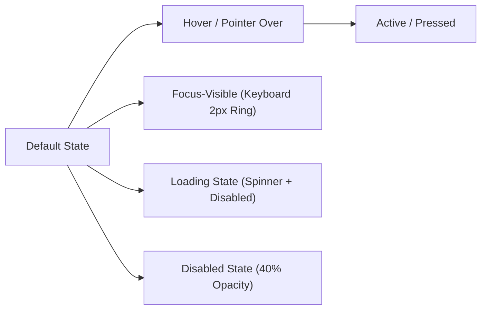
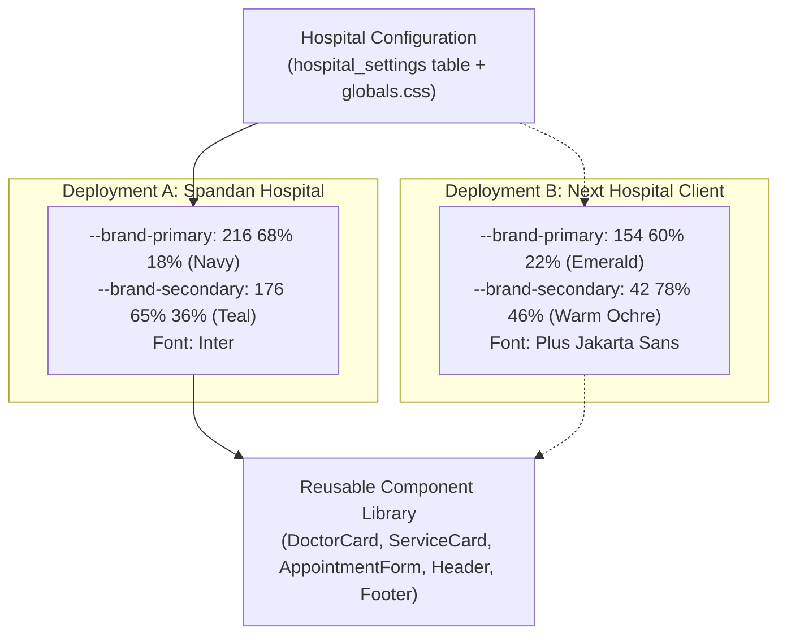

# Spandan Hospital: Master Design System Specification

> **Document Type:** Foundation Design System, Design Tokens & UI Architecture  
> **Target Entity:** Spandan Hospital (Lalghati / Airport Road, Bhopal, MP)  
> **Platform Paradigm:** Reusable Hospital Digital Platform (`CORE PLATFORM + HOSPITAL CONFIGURATION + OPTIONAL FEATURE MODULES`)  
> **Status:** Proposed Visual Specification (Phase 3A)  
> **Accessibility Standard:** WCAG 2.2 Level AA Compliant  

---

## 1. Brand Philosophy & Design Principles

Spandan Hospital is a small, doctor-owned cardiac care hospital led by two experienced interventional cardiologists (Dr. Rohit Kumar Shrivastava and Dr. Shashank Dixit). The visual system must communicate three foundational qualities:

$$\mathbf{Experienced\ Care} \quad\vert\quad \mathbf{Personal\ Attention} \quad\vert\quad \mathbf{Easy\ Access}$$

### The 6 Visual Principles:
1. **Calm, Medical Dignity:** Cardiac patients and their caregivers are under emotional distress. The interface must use serene, grounding tones, ample whitespace, and clean lines to reduce cognitive strain and panic.
2. **Clinical Trust Without Corporate Coldness:** Unlike faceless 500-bed corporate hospital chains (Apollo, Fortis) where doctors are anonymous directory entries, Spandan's strength is direct consultation with senior DM Cardiologists. The visual language must feel deeply human, warm, and attentive.
3. **Hyperlocal Clarity & Immediate Utility:** Essential information—emergency phone, WhatsApp desk, OPD timings, and Google Maps directions—must be accessible within 1 tap on any screen.
4. **Strict Healthcare Boundary:** Visual forms and microcopy must project professional clinical responsibility, never soliciting diagnoses, prescriptions, or sensitive medical histories online.
5. **Universal Accessibility (WCAG 2.2 AA):** High text contrast, large touch targets (minimum 48×48px), obvious focus rings, and readable typography across all device tiers.
6. **Platform Token Reusability:** No hardcoded hex values or arbitrary margins. The entire visual layer is expressed through semantic design tokens in CSS variables (`app/globals.css`) and Tailwind (`tailwind.config.ts`), enabling instant re-skinning for future hospital deployments.

---

## 2. Color System & Semantic Tokens

The proposed color palette avoids the aggressive, over-saturated blues of tech SaaS platforms and the cluttered reds of generic directory sites. It pairs a **Deep Medical Navy** (authority, stability, cardiac precision) with a **Restorative Teal** (vitality, breath, clinical healing) and a **Controlled Coral Red** strictly reserved for emergency actions.

### 2.1 Brand & Semantic Palette (HSL Token Definitions)

```css
/* app/globals.css — CSS Variable Design Tokens */
:root {
  /* ==========================================================================
     1. Brand Identity Tokens
     ========================================================================== */
  /* Primary: Deep Medical Navy — authority, clinical trust, grounded stability */
  --brand-primary: 216 68% 18%;         /* #0F2342 */
  --brand-primary-light: 215 54% 28%;   /* #213D6E */
  --brand-primary-dark: 218 80% 11%;    /* #060F1F */
  --brand-primary-foreground: 0 0% 100%;/* #FFFFFF */

  /* Secondary: Clinical Restorative Teal — vitality, renewal, cardiac rhythm */
  --brand-secondary: 176 65% 36%;       /* #209689 */
  --brand-secondary-light: 175 52% 48%; /* #3AB5A7 */
  --brand-secondary-dark: 177 75% 24%;  /* #0F4D46 */
  --brand-secondary-foreground: 0 0% 100%;

  /* Accent: Warm Cerulean — active indicators, highlights, subtle badges */
  --brand-accent: 201 82% 44%;          /* #1582CA */
  --brand-accent-light: 202 88% 94%;    /* #E4F3FD */
  --brand-accent-foreground: 216 68% 18%;

  /* Emergency: Controlled Coral Red — STRICTLY for Emergency hotline & acute chest pain */
  --brand-emergency: 0 76% 51%;         /* #E52E2E */
  --brand-emergency-hover: 0 82% 42%;   /* #C41C1C */
  --brand-emergency-surface: 0 86% 97%; /* #FDF2F2 */
  --brand-emergency-foreground: 0 0% 100%;

  /* WhatsApp Action: Trust WhatsApp Green */
  --brand-whatsapp: 142 70% 38%;        /* #1E9E49 */
  --brand-whatsapp-hover: 142 72% 31%;  /* #177D3A */
  --brand-whatsapp-foreground: 0 0% 100%;

  /* ==========================================================================
     2. Surface & Background Tokens
     ========================================================================== */
  --background: 210 20% 98%;            /* #F8F9FA — Soft medical off-white */
  --foreground: 218 35% 14%;            /* #17202A — Deep slate black for high contrast */
  
  --surface-white: 0 0% 100%;           /* #FFFFFF — Pure card surface */
  --surface-subtle: 210 25% 96%;         /* #F1F4F7 — Alternating section background */
  --surface-muted: 210 18% 92%;          /* #E8ECF0 — Inset blocks, table headers */
  --surface-overlay: 218 68% 18% / 0.75;/* Dark backdrop for modals */

  /* ==========================================================================
     3. Card & Inset Tokens
     ========================================================================== */
  --card: 0 0% 100%;
  --card-foreground: 218 35% 14%;
  --card-muted: 210 25% 97%;

  /* ==========================================================================
     4. Border & Divider Tokens
     ========================================================================== */
  --border: 214 20% 88%;                /* #DCE2E8 — Clean hairline division */
  --border-subtle: 214 24% 93%;         /* #EBF0F4 — Faint inner boundaries */
  --border-focus: 201 82% 44%;          /* Highlight focus ring */

  /* ==========================================================================
     5. Text & Content Tokens
     ========================================================================== */
  --text-primary: 218 35% 14%;          /* #17202A — Titles, headings, body text */
  --text-secondary: 215 16% 40%;        /* #566573 — Subtext, meta labels, captions */
  --text-muted: 215 14% 56%;            /* #85929E — Timestamps, disabled labels */
  --text-inverse: 0 0% 100%;            /* White text for dark banners */

  /* ==========================================================================
     6. Feedback & Status Tokens
     ========================================================================== */
  --status-success: 142 64% 36%;        /* #219653 */
  --status-success-surface: 140 50% 95%;/* #EEF8F1 */
  --status-warning: 38 92% 44%;         /* #D48806 */
  --status-warning-surface: 42 100% 96%;/* #FEF9E7 */
  --status-error: 0 76% 51%;            /* #E52E2E */
  --status-error-surface: 0 86% 97%;    /* #FDF2F2 */
  --status-info: 201 82% 44%;           /* #1582CA */
  --status-info-surface: 202 88% 95%;   /* #EBF5FB */
}
```

### 2.2 WCAG 2.2 Contrast Ratio Audit Matrix

| Foreground Token | Background Token | Calculated Ratio | WCAG 2.2 AA Standard | Evaluation |
| :--- | :--- | :--- | :--- | :--- |
| `--text-primary` (`#17202A`) | `--surface-white` (`#FFFFFF`) | **14.2:1** | $\ge 4.5:1$ (Normal text) | **Pass (AAA)** |
| `--text-primary` (`#17202A`) | `--surface-subtle` (`#F1F4F7`) | **12.6:1** | $\ge 4.5:1$ (Normal text) | **Pass (AAA)** |
| `--text-secondary` (`#566573`) | `--surface-white` (`#FFFFFF`) | **6.1:1** | $\ge 4.5:1$ (Normal text) | **Pass (AA)** |
| `--brand-primary` (`#0F2342`) | `--surface-white` (`#FFFFFF`) | **13.4:1** | $\ge 3.0:1$ (Large text) | **Pass (AAA)** |
| `--brand-secondary-dark` (`#0F4D46`) | `--surface-white` (`#FFFFFF`) | **7.8:1** | $\ge 4.5:1$ (Normal text) | **Pass (AAA)** |
| White (`#FFFFFF`) | `--brand-primary` (`#0F2342`) | **13.4:1** | $\ge 4.5:1$ (Buttons & Nav) | **Pass (AAA)** |
| White (`#FFFFFF`) | `--brand-secondary` (`#209689`) | **4.6:1** | $\ge 4.5:1$ (Accent buttons) | **Pass (AA)** |
| White (`#FFFFFF`) | `--brand-emergency` (`#E52E2E`) | **4.8:1** | $\ge 4.5:1$ (Emergency CTAs) | **Pass (AA)** |
| White (`#FFFFFF`) | `--brand-whatsapp` (`#1E9E49`) | **4.7:1** | $\ge 4.5:1$ (WhatsApp CTAs) | **Pass (AA)** |

> [!IMPORTANT]
> The Emergency Red token (`--brand-emergency`) is strictly restricted to urgent clinical action elements:
> 1. Top bar 24/7 Emergency Telephone trigger
> 2. Quick Action Emergency dialer
> 3. Form emergency disclaimer banner
> It must **never** be used as a routine accent color, link underline, or decorative border.

---

## 3. Typography System

The typography uses a clean, contemporary sans-serif font stack prioritizing clinical precision, high legibility at micro-sizes on mobile screens, and calm authority.

### 3.1 Recommended Font Family
- **Primary Typeface:** `Inter`, `-apple-system`, `BlinkMacSystemFont`, `"Segoe UI"`, `Roboto`, `sans-serif`
- **Alternative Heading Pair (Optional):** `Plus Jakarta Sans` or `Manrope` for headings; `Inter` for body.
- **Monospace (for Request IDs, Timestamps):** `ui-monospace`, `SFMono-Regular`, `"Menlo"`, `"Consolas"`, `monospace`

### 3.2 Type Scale Hierarchy

| Level | Size (Desktop / Mobile) | Line Height | Weight | Letter Spacing | Purpose & Usage |
| :--- | :--- | :--- | :--- | :--- | :--- |
| **Display** | `3.25rem (52px)` / `2.25rem (36px)` | `1.15` | Bold (700) | `-0.025em` | Homepage Hero primary headline |
| **H1** | `2.5rem (40px)` / `1.875rem (30px)` | `1.2` | SemiBold (600) | `-0.02em` | Sub-page headers, Doctor modal titles |
| **H2** | `1.875rem (30px)` / `1.5rem (24px)` | `1.25` | SemiBold (600) | `-0.015em` | Major Section headers (Why Spandan, Doctors, Services) |
| **H3** | `1.375rem (22px)` / `1.25rem (20px)` | `1.35` | SemiBold (600) | `-0.01em` | Doctor names, Service card titles, Sub-headers |
| **H4 / Subheading** | `1.125rem (18px)` / `1.0625rem (17px)` | `1.4` | Medium (500) | `0em` | Doctor qualifications badge, Service categories |
| **Body Large** | `1.125rem (18px)` / `1.0rem (16px)` | `1.6` | Regular (400) | `0em` | Hero lead paragraph, Section intro summaries |
| **Body Regular** | `1.0rem (16px)` / `1.0rem (16px)` | `1.55` | Regular (400) | `0em` | Standard descriptions, doctor bios, card body copy |
| **Body Medium** | `1.0rem (16px)` / `1.0rem (16px)` | `1.55` | Medium (500) | `0em` | Key operational facts, form input labels |
| **Small / Meta** | `0.875rem (14px)` / `0.875rem (14px)` | `1.45` | Regular/Medium | `0em` | Timings, card badges, helper text, form instructions |
| **Caption** | `0.75rem (12px)` / `0.75rem (12px)` | `1.4` | Medium (500) | `+0.02em` | Request ID tags, status pills, copyright, disclaimers |
| **Button Text** | `0.9375rem (15px)` / `0.9375rem (15px)`| `1.0` | SemiBold (600) | `+0.01em` | All interactive button triggers |

---

## 4. Geometry, Radii & Surface Elevation

A gentle, refined corner curve communicates modern approachability without looking childish or toy-like. Overly sharp corners feel sterile and intimidating; overly rounded capsules feel frivolous for cardiac care.

### 4.1 Border Radius Tokens

| Token | Value | Tailwind Class | Application |
| :--- | :--- | :--- | :--- |
| `--radius-sm` | `0.375rem (6px)` | `rounded-sm` | Badges, small tags, tooltips, inline status indicators |
| `--radius-md` | `0.5rem (8px)` | `rounded-md` | Buttons, form text inputs, select dropdowns, search bars |
| `--radius-lg` | `0.75rem (12px)` | `rounded-lg` | Quick action cards, service cards, stat blocks |
| `--radius-xl` | `1.0rem (16px)` | `rounded-xl` | Doctor profile cards, appointment form container, hero visual frame |
| `--radius-2xl` | `1.5rem (24px)` | `rounded-2xl` | Large modal dialogs, featured testimonial container |
| `--radius-full` | `9999px` | `rounded-full` | Circular avatar frames, emergency pill indicators, icon buttons |

### 4.2 Elevation & Shadow Scale

Shadows are soft, tinted with a touch of deep navy (`rgb(15 35 66 / ...)`) instead of harsh black:

```css
:root {
  /* Hairline elevation — cards at rest */
  --shadow-xs: 0 1px 2px 0 rgb(15 35 66 / 0.05);
  
  /* Low elevation — subtle cards, resting list items */
  --shadow-sm: 0 1px 3px 0 rgb(15 35 66 / 0.08), 0 1px 2px -1px rgb(15 35 66 / 0.08);
  
  /* Card elevation — standard content cards */
  --shadow-card: 0 4px 6px -1px rgb(15 35 66 / 0.07), 0 2px 4px -2px rgb(15 35 66 / 0.05);
  
  /* Hover elevation — interactive cards on hover */
  --shadow-md: 0 10px 15px -3px rgb(15 35 66 / 0.08), 0 4px 6px -4px rgb(15 35 66 / 0.04);
  
  /* High elevation — sticky floating bars, modals */
  --shadow-lg: 0 20px 25px -5px rgb(15 35 66 / 0.10), 0 8px 10px -6px rgb(15 35 66 / 0.04);
  
  /* Mobile sticky bottom bar elevation */
  --shadow-bottom-bar: 0 -4px 16px 0 rgb(15 35 66 / 0.08);
}
```

---

## 5. Spacing Scale & Layout Grid

### 5.1 Spacing Scale (8pt / 4pt Rhythm)
- `space-1`: `0.25rem (4px)` — Micro badge padding, icon gap
- `space-2`: `0.5rem (8px)` — Button inline icon gap, small tag padding
- `space-3`: `0.75rem (12px)` — Form input vertical padding, compact card padding
- `space-4`: `1.0rem (16px)` — Standard card padding on mobile, form element gap
- `space-6`: `1.5rem (24px)` — Standard desktop card padding, component margins
- `space-8`: `2.0rem (32px)` — Section header bottom margin, column gutter
- `space-12`: `3.0rem (48px)` — Section vertical padding on mobile
- `space-16`: `4.0rem (64px)` — Section vertical padding on tablet
- `space-24`: `6.0rem (96px)` — Major section vertical padding on desktop

### 5.2 Layout Grid & Maximum Widths
- **Site Max Container Width:** `1280px` (`max-w-7xl` in Tailwind) with `px-4 sm:px-6 lg:px-8` safe margin.
- **Text & Reading Container:** `680px` (`max-w-2xl`) for doctor bios, disclaimer, and editorial copy.
- **Form Container:** `640px` (`max-w-xl`) centered on desktop to focus patient attention.
- **Desktop Grid:** 12 columns, 24px gutter.
- **Tablet Grid:** 8 columns, 16px gutter.
- **Mobile Grid:** 4 columns, 16px gutter.

---

## 6. Button Styles & Interaction States

Every interactive element must provide unmistakable visual feedback across all states:



### 6.1 Button Taxonomy

| Button Variant | Base Visual | Hover State | Focus-Visible | Key Usage |
| :--- | :--- | :--- | :--- | :--- |
| **Primary (Solid Brand)** | Background: `--brand-primary` (`#0F2342`), Text: White | Background: `--brand-primary-light` (`#213D6E`) | 2px solid `--border-focus`, 2px offset | Primary CTAs: "Book Appointment", "Submit Request" |
| **Secondary (Solid Teal)** | Background: `--brand-secondary` (`#209689`), Text: White | Background: `--brand-secondary-light` (`#3AB5A7`) | 2px solid `--brand-secondary`, 2px offset | Secondary CTAs: "Explore Services", "Inquire" |
| **Emergency (Red Alert)** | Background: `--brand-emergency` (`#E52E2E`), Text: White, Bold | Background: `--brand-emergency-hover` (`#C41C1C`) | 2px solid `--brand-emergency`, 2px offset | 24/7 Hotline call buttons, Chest pain dialers |
| **WhatsApp Action** | Background: `--brand-whatsapp` (`#1E9E49`), Text: White | Background: `--brand-whatsapp-hover` (`#177D3A`) | 2px solid `--brand-whatsapp`, 2px offset | "Talk on WhatsApp", direct desk chat links |
| **Outline** | Border: 1.5px solid `--brand-primary`, Background: Transparent, Text: `--brand-primary` | Background: `--surface-subtle`, Border: `--brand-primary-light` | 2px solid `--border-focus`, 2px offset | "Talk to the Hospital", "View Full Profile" |
| **Ghost / Text** | Background: Transparent, Text: `--brand-primary`, Underline on hover | Background: `--surface-muted` | 2px solid `--border-focus`, 2px offset | Tertiary links, "Get Directions", "Cancel" |

### 6.2 Minimum Touch Target Rule
All buttons, icon buttons, and interactive triggers must maintain an interactive hit area of **at least 48×48px** on mobile viewports (`min-h-[48px] min-w-[48px]`), satisfying WCAG 2.2 Success Criterion 2.5.8 (Target Size).

---

## 7. Card Architecture & Surface Hierarchy

Cards organize information into distinct semantic chunks. They are never flat or bordered without intent.

### 7.1 Card Variants

1. **Standard Content Card (`card-base`):**
   - Background: `--surface-white`
   - Border: 1px solid `--border`
   - Border Radius: `--radius-lg` (12px)
   - Shadow: `--shadow-card`
   - Used for: Service items, quick facts, patient guidelines.

2. **Interactive Hover Card (`card-interactive`):**
   - Same as base, with `transition: all 200ms ease-out`
   - Hover state: Border shifts to `--brand-secondary-light`, Shadow shifts to `--shadow-md`, `transform: translateY(-2px)`.
   - Used for: Quick Action triggers, Service Cards with inquiry links.

3. **Featured Doctor Card (`card-doctor`):**
   - Background: `--surface-white` with subtle `--surface-subtle` header zone
   - Border: 1px solid `--border`
   - Border Radius: `--radius-xl` (16px)
   - Shadow: `--shadow-md`
   - Includes accent top strip: 4px border in `--brand-secondary` (`#209689`)
   - Generous padding: 24px mobile, 32px desktop.

4. **Alert / Notification Card (`card-alert`):**
   - Emergency variant: Background `--brand-emergency-surface`, Border 1px solid `--brand-emergency`, Icon `--brand-emergency`.
   - Info/Disclaimer variant: Background `--brand-accent-light`, Border 1px solid `--brand-accent`, Text `--brand-primary`.

---

## 8. Multi-Hospital Theming & Reusability Model

To satisfy the **Reusable Hospital Digital Platform** architecture, components do not hardcode Spandan Hospital colors or fonts.



### The Re-Theming Rule:
When deploying this exact repository for a future hospital client:
1. Update 6 CSS variables in `app/globals.css`.
2. Seed the new hospital's doctor roster and services into Supabase.
3. Replace the logo file in `/public/images/`.
4. **Zero React components or layout files require editing.**
