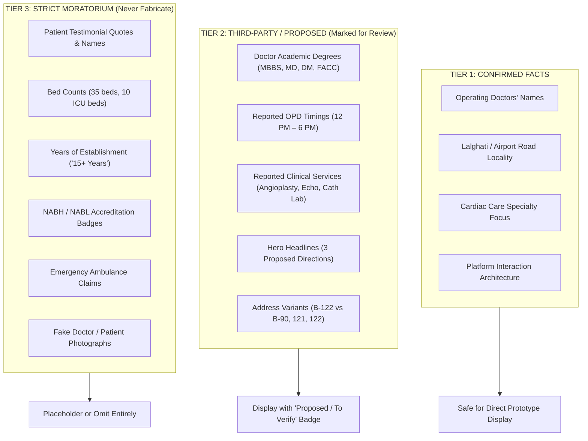

# Spandan Hospital: Prototype Content Integrity & Governance Rules

> **Document Type:** Prototype Content Rules, Verification Boundaries & Demonstration Ethics  
> **Target Entity:** Spandan Hospital (Lalghati / Airport Road, Bhopal, MP)  
> **Target Audience for Prototype:** Dr. Rohit Kumar Shrivastava and Dr. Shashank Dixit (Operating Cardiologists & Founders)  
> **Status:** Active Governance Protocol for Sales Demonstration (Phase 3A)  
> **Prime Objective:** Build an impeccably polished, high-fidelity interactive sales prototype that demonstrates the digital experience without misrepresenting unverified claims, inventing clinical data, or fabricating testimonials.  

---

## 1. Context & Demonstration Objective

This web portal is currently being engineered as a **private, high-fidelity sales prototype**. Dr. Rohit Kumar Shrivastava and Dr. Shashank Dixit have not yet formally commissioned the platform.

The goal of this demonstration is to **impress the doctors with the EXPERIENCE**:
- The speed and elegance of the interface on a smartphone.
- The dignified, respectful spotlight placed on their medical qualifications (DM Cardiology, FACC).
- The seamless 30-second appointment booking intake and instant WhatsApp connection.
- The elimination of third-party aggregator dependency (Justdial, Bajaj Finserv).

### The Golden Rule of Medical Content Integrity:
> [!CAUTION]
> **Zero Fabrication Policy:**  
> Senior medical doctors have zero tolerance for factual misrepresentation, exaggerated clinical claims, fake testimonials, or unauthorized statistics. A single fabricated metric (e.g. claiming an unverified bed count or inventing an award) will instantly destroy professional trust and ruin the commercial proposal.
> 
> In the prototype: **Every interaction must be believable, but no unverified fact may be presented as verified truth.**

---

## 2. Content Classification Tiers

All website content is categorized into three strict governance tiers:

---

## 3. Detailed Content Rules by Section

### 3.1 Hero Section
- **What Can Be Used:**
  - Hospital Name: *"Spandan Hospital"*
  - Locality: *"Lalghati, Airport Road, Bhopal"*
  - The 3 proposed headline options:
    1. *"Experienced care. Personal attention."* `[PROPOSED]`
    2. *"Heart care with a more personal approach."* `[PROPOSED]`
    3. *"Expert cardiac care, close to home."* `[PROPOSED]`
  - CTAs: *"Book an Appointment"*, *"Talk to the Hospital"*, *"Get Directions"*
- **What Requires Hospital Approval:** Final selection of primary headline, official hospital tagline.
- **What Must NEVER Be Fabricated:**
  - ❌ Do NOT claim "Bhopal's #1 Cardiac Hospital" or "Highest Success Rate".
  - ❌ Do NOT claim "NABH Accredited" unless official certificate is presented.
  - ❌ Do NOT use generic stock photos of smiling Caucasian or foreign doctors.

### 3.2 Doctors Section
- **What Can Be Used:**
  - Names: **Dr. Rohit Kumar Shrivastava** and **Dr. Shashank Dixit**.
  - Degrees from public medical directories:
    - Dr. Rohit: `MBBS, MD (General Medicine), DM (Cardiology)` `[PROPOSED FOR REVIEW]`
    - Dr. Shashank: `MBBS, MD (Medicine), DM (Cardiology), FACC` `[PROPOSED FOR REVIEW]`
  - OPD consultation hours from directories: `Mon – Sat: 12:00 PM – 6:00 PM` `[PROPOSED FOR REVIEW]`
- **What Requires Hospital Approval:**
  - High-resolution professional studio portraits in medical coats.
  - Confirmed granting universities and year of completion.
  - Active consultation days, time windows, and consultation fees.
  - Approved 3-sentence biography narrative.
- **What Must NEVER Be Fabricated:**
  - ❌ NEVER invent additional medical degrees, honorary doctorates, or unearned fellowships.
  - ❌ NEVER download low-resolution candid photos from private Facebook/social media profiles without permission. Use a clean, dignified clinical monogram or vector placeholder until official portraits are supplied.

### 3.3 Clinical Services & Facilities
- **What Can Be Used:**
  - The 6 core cardiac clinical categories synthesized from public directory listings:
    1. *Interventional Cardiology (Angioplasty & Angiography)*
    2. *Cardiac Rhythm Management (Pacemakers)*
    3. *Non-Invasive Diagnostics (2D Echo, TMT, ECG, Holter)*
    4. *Intensive Cardiac Care (ICCU)*
    5. *Pathology & Cardiac Markers*
    6. *On-Site Pharmacy*
  - Plain-language patient descriptions of each procedure.
- **What Requires Hospital Approval:**
  - Exact confirmation of which procedures are performed on-site vs referred out.
  - Confirmation of Cath Lab equipment and pathology capabilities.
- **What Must NEVER Be Fabricated:**
  - ❌ Do NOT claim open-heart bypass surgery (CABG) or heart transplants unless explicitly confirmed by the operating doctors.
  - ❌ Do NOT invent advanced sub-specialties (Pediatric Cardiac Surgery, Electrophysiology 3D Mapping) without verification.

### 3.4 Patient Stories & Testimonials
- **What Can Be Used in the Prototype:**
  - The prototype UI must clearly show the layout for featured and supporting testimonials.
  - **MANDATORY Prototype Placeholder Standard:**  
    Every testimonial card in the sales prototype must display explicit placeholder text:
    > *"Sample patient story — replace with hospital-approved testimonial."*  
    > Attribution: *— Patient / — Ramesh P. / — Patient's Family*
  - **Strict Removal of Clinical Context Badges:** Testimonials must NOT reveal unnecessary medical conditions, diagnoses, or sensitive health information. Clinical context badges (e.g., condition labels, procedure tags) are strictly removed. Use privacy-preserving attribution such as *"— Patient"*, *"— Ramesh P."*, or *"— Patient's Family"*.
- **What Requires Hospital Approval:**
  - Hospital management must provide 3–5 written feedback excerpts from real patients who gave explicit consent to be quoted on the website.
- **What Must NEVER Be Fabricated:**
  - ❌ NEVER invent fake glowing testimonials (e.g. "Dr. Rohit saved my father's life when everyone gave up").
  - ❌ NEVER copy full patient names, mobile numbers, or photographs from Google Maps or Justdial reviews.
  - ❌ NEVER reveal private medical conditions or attach clinical diagnosis badges without explicit consent.

### 3.5 Operational Numbers, Bed Counts & History
- **The "15+ Years" Claim:**
  - Sourced from Justdial's public directory badge.
  - *Prototype Rule:* Display as: *"Serving the Lalghati & Bhopal Community"* without hardcoding "Established in 2009" until the registration deed is verified.
- **Bed Counts (35 Total Beds / 10 ICU Beds):**
  - Sourced from Bajaj Finserv Health.
  - *Prototype Rule:* In the prototype stat blocks, keep the layout functional but label the metric clearly:  
    `[Facility Bed Count — To Be Confirmed by Hospital]` or omit specific numerical counts from primary badges until verified.
- **What Must NEVER Be Fabricated:**
  - ❌ Do NOT invent survival rates (e.g. "99% Angioplasty Success Rate").
  - ❌ Do NOT invent procedure tallies (e.g. "Over 10,000 Angioplasties Completed") unless backed by the hospital's registered surgical logbook.

### 3.6 Location & Contact Information
- **What Can Be Used:**
  - Primary Locality: *Indra Vihar Colony, Airport Road, Lalghati, Bhopal*
  - Desk / Emergency Contact: *Configured via `hospital_settings` / dynamic placeholders pending hospital verification*
- **Known Discrepancies Requiring Verification:**
  - Door/Plot Number: Justdial lists `B-122`; Bajaj Finserv lists `B-90, 121, 122`. (Verify official municipal sign).
  - PIN Code: Conflict between `462030` (Lalghati post office) and `462001` (Bhopal GPO).
- **What Must NEVER Be Fabricated:**
  - ❌ DO NOT hardcode the currently reported emergency phone number into the visual design. Use configuration and placeholders (e.g., `[Emergency Phone: To Be Verified]` or settings token) until the hospital verifies the official emergency/reception number.
  - ❌ Do NOT publish random mobile numbers for emergency dialers.

---

## 4. Healthcare Data Privacy & Form Guardrails

The public appointment request form strictly enforces healthcare data minimization principles:

### 4.1 Permitted Public Intake Fields:
1. Patient Full Name
2. Mobile Phone Number (10 digits)
3. Optional Email Address
4. Preferred Doctor (Choice: Dr. Rohit / Dr. Shashank / Any Available)
5. Preferred Service (Choice: Consultation / 2D Echo / Health Checkup / General)
6. Preferred Date & Time Window (Morning / Afternoon / Evening)
7. Short Reason for Visit (Single line: e.g. "General Checkup", "BP Checkup", "Follow-up")

### 4.2 Prohibited Public Intake Fields (Strict Healthcare Boundary):
> [!CAUTION]
> The form must **NEVER** solicit, store, or accept:
> - Detailed medical histories or past surgical records
> - Diagnostic symptom checklists (e.g. severity scales, self-triage questionnaires)
> - Medical reports, lab scans, or PDF uploads
> - Prescription uploads or medication lists
> - Government health IDs (Aadhaar, ABHA ID) in V1

### 4.3 Mandatory Form Disclaimer Microcopy:
Every appointment form instance must prominently display the following reassurance:
> *"Notice: This form is intended solely to coordinate outpatient appointment schedules. Our team will contact you to confirm your request. Please do NOT submit sensitive medical records, prescriptions, or clinical histories. For acute chest pain or emergency medical situations, please call our emergency hotline immediately."*

### 4.4 Intake Confirmation Message:
- The prototype must NOT promise a "30-minute callback commitment" or specific turnaround SLA.
- Standard confirmation message: *"Our team will contact you to confirm your request."*
- A specific callback SLA can be added later only after hospital approval.

---

## 5. Sales Demonstration Protocol & Client Presentation Etiquette

When presenting the high-fidelity interactive prototype to Dr. Rohit Kumar Shrivastava and Dr. Shashank Dixit:

1. **Acknowledge the Research Baseline:**
   - Open by explaining that the prototype was prepared using publicly available directory data to demonstrate the digital experience.
   - Clarify immediately that all bios, services, and operational hours are presented for their clinical review and correction.
2. **Demonstrate Mobile-First Speed:**
   - Present the prototype on a live smartphone first, not a laptop screen.
   - Show how quickly an anxious patient can tap `"Call Desk"`, `"Chat on WhatsApp"`, or `"Book Consultation"`.
3. **Highlight the Doctor-Led Differentiation:**
   - Show how the prototype elevates the two doctors as respected clinicians with their full DM Cardiology qualifications, contrasting it with cluttered aggregator sites where their names are buried under sponsored ads.
4. **Present the Verification Checklist (`/references/HOSPITAL-VERIFICATION-CHECKLIST.md`):**
   - Provide the checklist as a collaborative handover document.
   - Explain: *"We have built the entire digital engine; we simply need a brief review session to verify your preferred phone numbers, official portraits, and exact consultation hours before going live."*
5. **Respect Clinical Authority:**
   - Never debate medical terminology with the doctors. If they wish to rename a service or adjust a clinical description, accept their guidance instantly.
