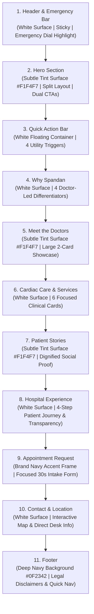
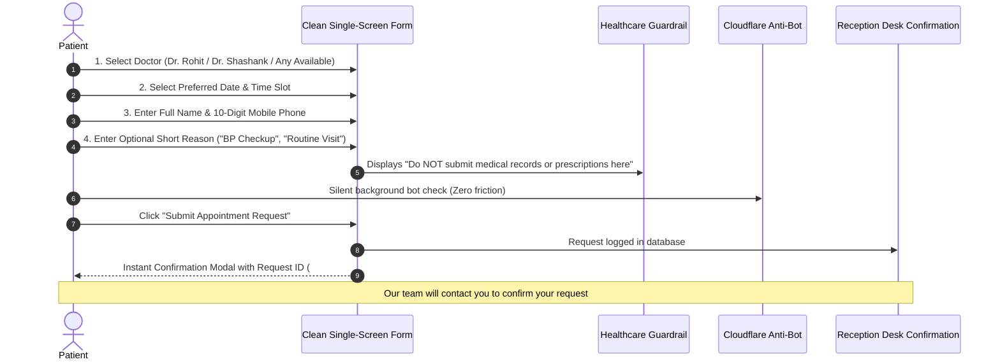

# Spandan Hospital: Visual Direction & Aesthetic Blueprint

> **Document Type:** Visual Direction, Art Direction & Page Rhythm Specification  
> **Target Entity:** Spandan Hospital (Lalghati / Airport Road, Bhopal, MP)  
> **Target Audience:** Prospective cardiac patients, adult sons/daughters arranging care for aging parents, acute cardiac lookups  
> **Design Paradigm:** Reusable Hospital Digital Platform — Doctor-Led Community Sanctuary  
> **Sales Prototype Context:** Private high-fidelity demonstration for Dr. Rohit Kumar Shrivastava and Dr. Shashank Dixit  

---

## 1. Visual Mood & Aesthetic Statement

The visual identity of Spandan Hospital establishes a **calm, dignified clinical sanctuary**. A patient or caregiver visiting this website is frequently experiencing stress, chest discomfort, or medical uncertainty. Every visual choice must actively lower emotional temperature and inspire quiet confidence.

### 1.1 What the Design Feels Like:
- **Premium & Sophisticated:** Polished micro-typography, generous whitespace, disciplined color application, and refined card surfaces.
- **Calm & Human:** Grounded medical navy and healing teal; absence of alarmist banners or hyperactive motion.
- **Doctor-Led & Attentive:** The hospital is not a faceless corporate conglomerate; it is led directly by two accomplished DM Cardiologists whose personal attention defines the patient experience.
- **Clinical & Trustworthy:** Clean clinical geometry, verified academic credentials, and clear operational details.
- **Fast & Accessible:** Instant load times on standard 4G mobile networks, high-contrast text, and thumb-friendly controls.

### 1.2 What the Design Strictly AVOIDS (The "Must NOT Look Like" Guardrail):
| Antipattern Category | Why We Strictly Reject It |
| :--- | :--- |
| **Apollo / Fortis Corporate Clone** | Overcrowded multi-city dropdowns, 50-item mega-menus, corporate stock photos, discount "health checkup" sales banners, and impersonal doctor lists. |
| **Generic WordPress Hospital Template** | Cluttered sidebars, outdated table layouts, generic clip-art stethoscopes, fake customer reviews with smiling foreign models, and broken appointment widgets. |
| **Tech SaaS / Startup Landing Page** | Fluorescent purple gradients, dark-mode toggle gimmicks, floating 3D spheres, cartoon isometric illustrations, and overly playful copy. |
| **Government Healthcare Portal** | Drab bureaucratic layouts, dense walls of regulatory text, unstyled links, poor mobile responsiveness, and uninviting tabular reports. |
| **Overly Animated Showcase** | Aggressive parallax scrolling, distracting auto-playing carousels, text that slides in from multiple directions, or slow page-transition curtains that waste urgent patient seconds. |

---

## 2. Core Brand Idea & Doctor-Led Positioning

$$\mathbf{Experienced\ Care.} \quad\mathbf{Personal\ Attention.} \quad\mathbf{Easy\ Access.}$$

### The Small Hospital Advantage
In healthcare branding, large corporate hospital chains often suffer from a reputation of impersonal bureaucracy, junior doctor handoffs, and inflated diagnostic billing. 

Spandan Hospital turns its intimate, focused scale into its greatest clinical advantage:
1. **Direct Access to Senior Specialists:** When a patient visits Spandan Hospital, they are evaluated directly by a senior DM Cardiologist—not a rotating resident medical officer or junior trainee.
2. **Integrated, Compact Infrastructure:** With an on-site Cath lab, 10-bed ICU, and in-house diagnostic pathology and 2D Echo, all cardiac assessments occur under one roof without navigating vast hospital wings.
3. **Hyperlocal Convenience:** Located conveniently along Airport Road in Lalghati, Spandan saves critical transit time for families across western and northern Bhopal, Bairagarh, and Gandhi Nagar.

The two doctors—**Dr. Rohit Kumar Shrivastava** and **Dr. Shashank Dixit**—are the clinical heart and human face of the institution. They are positioned as respected community clinicians and compassionate counselors, not distant administrators.

---

## 3. Hero Visual Direction & Headline Explorations

The homepage hero creates the immediate first impression. It must balance medical authority with emotional accessibility.

### 3.1 Hero Layout Architecture (Desktop & Mobile)

```text
┌─────────────────────────────────────────────────────────────────────────────┐
│ DESKTOP HERO LAYOUT (Split 60/40)                                           │
├──────────────────────────────────────┬──────────────────────────────────────┤
│ [Badge: Senior DM Cardiologists]     │                                      │
│                                      │  DIGNIFIED VISUAL CONTAINER:         │
│ PROPOSED HEADLINE (Display 52px)     │  • Real hospital facade photo        │
│ "Experienced care.                   │    (when supplied by client)         │
│  Personal attention."                │  • Elegant architectural abstraction │
│                                      │    with soft teal vignette           │
│ Subheadline (Body Large 18px)        │  • ZERO fake foreign doctor photos   │
│ Focused cardiac consultations and    │                                      │
│ advanced treatment led directly by   │  [Floating Credibility Pill]         │
│ senior cardiologists in Lalghati.    │  "Consult Directly with Specialists" │
│                                      │                                      │
│ [Primary CTA: Book an Appointment]   │                                      │
│ [Secondary CTA: Talk to Hospital]    │                                      │
│ [Tertiary Link: Get Directions]      │                                      │
└──────────────────────────────────────┴──────────────────────────────────────┘
```

### 3.2 Three Proposed Headline Directions
*Note: The hospital operating doctors have not yet finalized the marketing copy. The following three directions are provided for client review. None contain fabricated clinical claims or unverifiable statistics.*

#### Direction 1: The Personal Care Anchor (Recommended)
- **Primary Headline:** *"Experienced care. Personal attention."* `[PROPOSED]`
- **Subheadline:** *"Consult directly with senior DM Cardiologists at Lalghati's dedicated cardiac center. Unhurried outpatient consultations, comprehensive heart diagnostics, and 24/7 emergency support."* `[PROPOSED]`
- **Strategic Tone:** Understated, dignified, clinically reassuring. Directly addresses the common patient frustration with rushed corporate consultations.

#### Direction 2: The Modern Heart Care Approach
- **Primary Headline:** *"Heart care with a more personal approach."* `[PROPOSED]`
- **Subheadline:** *"Specialized cardiac evaluations, on-site diagnostics, and direct doctor attention in a calm, patient-centered community hospital on Airport Road."* `[PROPOSED]`
- **Strategic Tone:** Warm, approachable, emphasizing the contrast between an intimate hospital and an overwhelming mega-facility.

#### Direction 3: The Hyperlocal Proximity Anchor
- **Primary Headline:** *"Expert cardiac care, close to home."* `[PROPOSED]`
- **Subheadline:** *"Senior interventional cardiologists, advanced cardiac diagnostics, and emergency care serving Lalghati, Bairagarh, and western Bhopal without the cross-city drive."* `[PROPOSED]`
- **Strategic Tone:** Pragmatic, convenient, geographically resonant for families who want trusted specialists within 10 minutes of their neighborhood.

### 3.3 Hero Action Triggers
1. **Primary CTA (Solid Brand Navy):** `"Book an Appointment"` ➔ Smooth-scrolls to Section 9 (Appointment Intake Form).
2. **Secondary CTA (Solid Restorative Teal):** `"Talk to the Hospital"` ➔ Launches direct WhatsApp connection (`wa.me`) or calls desk.
3. **Tertiary Link (Subtle Ghost / MapPin Icon):** `"Get Directions"` ➔ Opens Google Maps GPS route planner directly to the hospital gate.

### 3.4 Hero Imagery Policy
- **Primary Option (Upon Client Supply):** Genuine, high-resolution exterior photography of the Spandan Hospital building or welcoming, brightly lit reception lobby.
- **Prototype Treatment (Before Client Supply):** A tasteful, high-contrast photographic frame showing a serene clinical environment (modern diagnostic consultation suite, clean aesthetic interior) treated with a soft 15% brand navy gradient overlay, or an elegant SVG cardiac vector motif.
- **Strict Prohibition:** NEVER use generic stock photos of smiling Western doctors with fake stethoscopes. Such imagery instantly destroys credibility with Indian patients and offends senior Indian physicians.

---

## 4. Homepage Visual Hierarchy & Rhythm

The homepage consists strictly of the **11 recommended sections**, sequenced to guide the patient from initial discovery to confident contact. Alternating surface tones prevent visual fatigue and create structured reading landmarks.



### Section-by-Section Visual Rhythm Breakdown:

| # | Section Name | Background Tone | Dominant Visual Element | Patient Psychological Goal |
| :--- | :--- | :--- | :--- | :--- |
| **1** | **Header** | White (`#FFFFFF`) | Logo + Red Emergency Call Button | "I am at the right hospital; help is 1 click away." |
| **2** | **Hero** | Soft Tint (`#F1F4F7`) | Display Headline + Clinical Facility Frame | "These are senior cardiologists close to home." |
| **3** | **Quick Actions** | White (`#FFFFFF`) / Float | 4 High-Utility Icon Cards (Emergency, WhatsApp, OPD, Map) | "I can immediately call, chat, or get directions." |
| **4** | **Why Spandan** | White (`#FFFFFF`) | 4 Structured Pillar Cards with Teal Accents | "Here I get real doctor time without corporate delays." |
| **5** | **Meet the Doctors** | Soft Tint (`#F1F4F7`) | **Two Large Doctor Profile Cards (Prominent Focus)** | "Dr. Rohit & Dr. Shashank are highly qualified specialists." |
| **6** | **Cardiac Care** | White (`#FFFFFF`) | 6 Clean Specialty Blocks with Minimal Line Icons | "They perform the exact diagnostic or procedure I need." |
| **7** | **Patient Stories** | Soft Tint (`#F1F4F7`) | Featured Testimonial Quote + Privacy-Preserving Attribution | "Other patients trust them and had successful outcomes." |
| **8** | **Hospital Experience**| White (`#FFFFFF`) | Vertical 4-Step Journey Timeline & Visiting Hours | "I know exactly what to bring and what to expect." |
| **9** | **Appointment CTA** | Soft Teal Tint or White | Centered Form Container (`max-w-xl`) with Privacy Notice | "I can request my slot in 30 seconds with zero spam." |
| **10**| **Contact & Map** | White (`#FFFFFF`) | Embedded Google Map + Structured Desk Phone Box | "Here is the exact gate location and phone number." |
| **11**| **Footer** | Deep Navy (`#0F2342`) | White Typography, Statutory Disclaimer, Staff Portal Link | "This is an established, transparent healthcare entity." |

---

## 5. Doctor Experience: Prominent Two-Doctor Showcase

Because Spandan Hospital is operated by **two principal cardiologists**, we explicitly avoid the generic "doctor directory" pattern (which displays a dense grid of 12 tiny thumbnails).

### 5.1 Presentation Philosophy
- **Large, Expansive Cards:** Each doctor receives an expansive, high-hierarchy profile card (occupying a full 50% width on desktop, stacked cleanly on mobile).
- **Heroic Visual Framing:** Dedicated portrait container with an elegant rounded frame (`--radius-xl`), subtle warm border, and clinical badge.
- **Academic Distinction:** Prominent display of verified super-specialized degrees (`MBBS, MD, DM Cardiology`) and fellowships (`FACC`).
- **Direct Conversion:** Each doctor's card includes their specific OPD hours and an explicit direct action: `"Book Consultation with Dr. [Name]"`, which pre-selects the doctor in the appointment form.

```text
┌─────────────────────────────────────────────────────────────────────────────┐
│ DOCTOR CARD ANATOMY                                                         │
├─────────────────────────────────────────────────────────────────────────────┤
│ ┌───────────────┐  Dr. Shashank Dixit                                       │
│ │               │  Consultant Interventional Cardiologist                   │
│ │  PORTRAIT     │  MBBS, MD (Medicine), DM (Cardiology), FACC               │
│ │  CONTAINER    │  ───────────────────────────────────────────────────────  │
│ │  (High-Res)   │  Specialization: Angioplasty, Pacemakers, Heart Failure   │
│ │               │  Consultation Hours: Mon – Sat: 12:00 PM – 6:00 PM        │
│ └───────────────┘  ───────────────────────────────────────────────────────  │
│                    [ Book Consultation with Dr. Shashank ]  [ View Details ]│
└─────────────────────────────────────────────────────────────────────────────┘
```

> [!IMPORTANT]
> Until the hospital supplies official studio portraits, the prototype uses an elegant, respectful medical silhouette/monogram graphic. Random internet photos or stock models must NEVER be substituted.

---

## 6. Services & Cardiac Care Discovery

We reject sprawling 50-item department trees. Cardiac care is organized into **6 focused, patient-centered discovery blocks**:

1. **Interventional Cardiology:** Coronary Angiography (Radial/Femoral), Angioplasty & Stenting (PTCA), Emergency Ballooning.
2. **Cardiac Rhythm & Pacemakers:** Permanent & Temporary Pacemaker Implantation, Arrhythmia & Palpitation Management.
3. **Non-Invasive Diagnostics:** 2D Echocardiography, Color Doppler, TMT (Treadmill Stress Test), ECG, Holter Monitoring.
4. **Intensive Cardiac Care (ICCU):** 24/7 Monitored Cardiac Beds with continuous multipara telemetry and ventilator support.
5. **Pathology & Clinical Laboratory:** In-house urgent cardiac markers (Troponin-I, CPK-MB), lipid profiles, and routine blood tests.
6. **Cardiac Pharmacy & Dispensary:** On-site supply of cardiac medicines, anticoagulants, and chronic heart medications.

*Visual Card Style:* Clean white card, hairline border, subtle teal icon container, concise 2-sentence description in non-jargon language, and a discreet `"Inquire About This Service"` text link.

---

## 7. Patient Stories & Social Proof Direction

Social proof must be understated, dignified, and strictly compliant with medical privacy ethics.

### 7.1 Visual Execution
- **Featured Testimonial Block:** A prominent, slightly elevated card featuring a meaningful patient experience quote with quotation iconography.
- **Privacy-Preserving Attribution:** Testimonials must not reveal unnecessary medical conditions or sensitive health information. Clinical context badges are strictly removed. Use privacy-preserving attribution such as *"— Patient"*, *"— Ramesh P."*, or *"— Patient's Family"*.
- **Rating Display Policy:** If verified through public directory data (e.g., Justdial 4.0/5 rating based on 380+ reviews), it must be clearly attributed to the source. If unverified, star ratings are omitted entirely.
- **Prototype Placeholder Standard:** In the sales demonstration, placeholders must be explicitly marked:  
  *`"Sample patient story — replace with hospital-approved testimonial."`*

---

## 8. Appointment Intake Experience

The appointment intake section represents the primary conversion mechanism. It is designed to be frictionless, fast, and respectful of patient privacy.



### Strict Healthcare Guardrail:
The form and microcopy must explicitly state:
> *"This form is for scheduling outpatient consultations. Our team will contact you to confirm your request. Please do NOT enter medical records, lab reports, or sensitive health histories. For acute chest pain or medical emergencies, call our 24/7 emergency hotline immediately."*

---

## 9. Animation & Motion Guidelines

Motion must serve utility and reassurance, never entertainment or flair.

### 9.1 Permitted Subtle Animations
- **Section Entrance:** Gentle vertical fade (`opacity: 0 -> 1`, `translateY: 10px -> 0px`, duration `300ms ease-out`).
- **Interactive Button Feedback:** Instant background color shift with micro-scale (`scale: 0.98` on active press, duration `100ms`).
- **Card Hover:** Subtle elevation lift (`translateY: -2px`, box-shadow transition, duration `200ms ease-out`).
- **Modal Dialog:** Instant clean backdrop fade (`150ms`) and subtle dialog scale-in (`98% -> 100%`).

### 9.2 Strictly Prohibited Animations
- ❌ No continuous bouncing or pulsing icons (except an optional slow, calm heartbeat pulse on the emergency indicator).
- ❌ No auto-playing text carousels that change before elderly patients can read them.
- ❌ No multi-layer parallax scrolling that causes nausea or drops mobile frame rates.
- ❌ No intrusive fly-in banners or aggressive spin-the-wheel marketing widgets.

### 9.3 Accessibility Motion Rule
```css
@media (prefers-reduced-motion: reduce) {
  *, *::before, *::after {
    animation-duration: 0.01ms !important;
    animation-iteration-count: 1 !important;
    transition-duration: 0.01ms !important;
    scroll-behavior: auto !important;
  }
}
```

---

## 10. Performance & Network Architecture

Mobile-first because patients commonly discover and contact healthcare providers from phones. The design is architected for **instant responsiveness under real-world network constraints**:

1. **Pre-Rendered Static Generation (SSG / ISR):** Public marketing pages are pre-built HTML. A patient loading the site never waits for a cold database query to spin up.
2. **Strict Asset Budget:**
   - Total initial page weight: $< 800\text{ KB}$ (excluding user-triggered maps).
   - Core Web Vitals target: **Largest Contentful Paint (LCP) $< 2.0\text{s}$**, **Cumulative Layout Shift (CLS) $< 0.05$**, **Interaction to Next Paint (INP) $< 150\text{ms}$**.
3. **Next.js Image Optimization:** All photos served in next-gen WebP/AVIF formats with responsive `srcset` and explicit `width`/`height` to guarantee zero layout shifts.
4. **Zero Heavy Video Payloads:** No background autoplay video banners that drain patient battery or mobile data.
5. **Lazy Loaded Embeds:** The Google Maps interactive iframe is loaded only when the user scrolls near the contact section (`loading="lazy"`).
