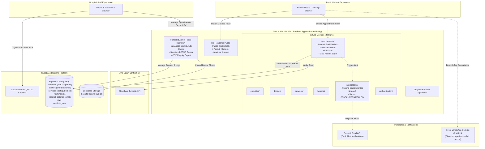
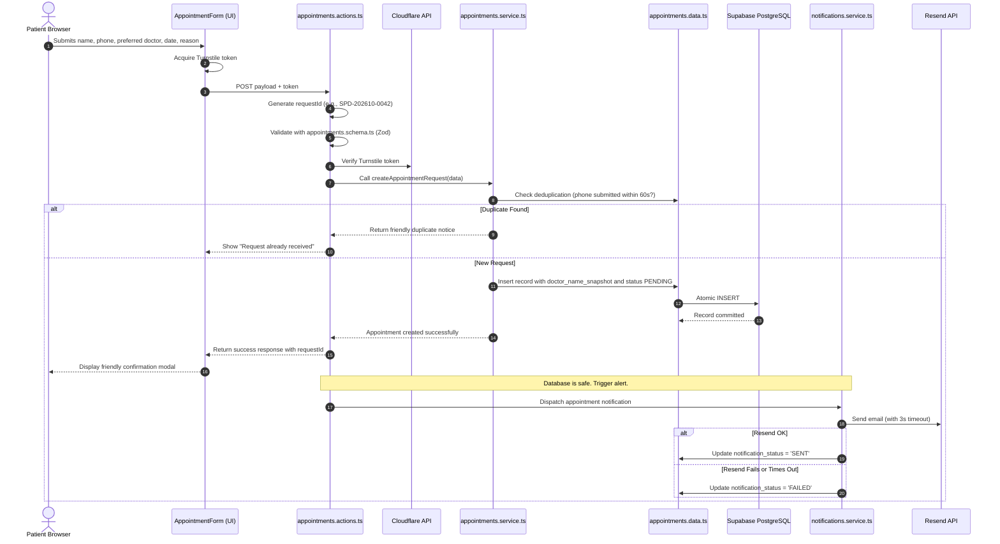

# System Architecture: Spandan Hospital Web Portal

> **Status:** Approved Architecture Specification (Future-Ready Modular Monolith)  
> **Deployment Target:** Netlify (Commercial Free Tier)  
> **Backend & Storage:** Supabase (PostgreSQL + Auth + Storage)  
> **Project Layout:** Next.js Monolith with Feature Modules at Repository Root

---

## 1. Overview & Architectural Principles

The Spandan Hospital system is structured as a **clean modular monolith** designed for a two-doctor community hospital and maintained by a solo beginner developer. It avoids unnecessary operational friction, distributed service complexity, and recurrent infrastructure costs.

### Core Architectural Axioms
1. **Single Root Monolith:** Both the public marketing portal and the protected hospital staff dashboard live in a single Next.js project situated directly at the **repository root**.
2. **Feature Module Boundaries (`/features/`):** Business logic is grouped into self-contained feature folders (`enquiries`, `appointments`, `doctors`, `services`, `testimonials`, `hospital`, `notifications`, `authentication`), preventing UI components from tangling with database queries.
3. **Layered Separation of Concerns:** A strict, readable flow separates presentation from persistence: `UI -> Server Action -> Schema Validation -> Business Logic -> Data Access -> Supabase`.
4. **Static Generation & Reliability:** Public patient pages are statically generated with Incremental Static Regeneration (ISR). Normal public visits do not query PostgreSQL directly, ensuring the website remains 100% available even during database maintenance or pauses.
5. **Database as Single Source of Truth:** Atomic persistence in Supabase PostgreSQL precedes any notification triggers.
6. **Simple Queue-Free Notifications:** There is **no Redis, Kafka, or background worker**. The system saves the record first (`PENDING`), attempts Resend email with a 3-second timeout, updates to `SENT` or `FAILED`, and allows manual retries from the dashboard.
7. **No Direct Public REST Inserts:** Anonymous public visitors have no direct `INSERT` permissions on the Supabase REST API. Inbound appointments pass exclusively through a Next.js Server Action that verifies bot tokens, validates input, checks duplicates, and commits via the server client.
8. **Future-Ready Extensibility:** Clean architectural boundaries allow future additions (WhatsApp Cloud API, online payments, AI assistance, HIS integration) without rewriting the core V1 system.

---

## 2. Technology Stack

| Layer | Technology | Rationale & Commercial Alignment |
| :--- | :--- | :--- |
| **Framework** | Next.js (App Router, TypeScript) | Unified full-stack monolith: pre-rendered static pages, Server Actions, and authenticated dashboard routes. |
| **Hosting & CI/CD** | **Netlify** | Commercial-friendly free tier (avoids Vercel Hobby commercial restrictions), instant rollbacks, preview deploys. |
| **Styling & UI** | Tailwind CSS + Lucide Icons + Radix UI Primitives | Clean utility classes, accessible components, zero runtime CSS overhead, design token variables. |
| **Database** | Supabase PostgreSQL | Managed relational database with strong schemas, Row Level Security, and automated connection handling. |
| **Authentication** | Supabase Auth (SSR Cookie Sessions) | Secure cookie session handling for hospital staff without custom cryptography code. |
| **File Storage** | Supabase Storage (`hospital-assets`) | S3-compatible bucket for doctor photos and certificates (5 MB upload limit, public CDN). |
| **Bot / Spam Shield** | Cloudflare Turnstile | Free, privacy-friendly bot challenge with server-side validation. Zero annoying image puzzles for patients. |
| **Transactional Email** | Resend (Free Tier) | 3,000 emails/month free tier; clean REST API; used solely for desk notification alerts. |
| **Instant Messaging** | Standard `wa.me` Click-to-Chat | Free 1-tap browser links directly to the hospital WhatsApp phone; ₹0 monthly API costs. |

---

## 3. High-Level System Architecture Diagram



---

## 4. Ingestion Flow: UI, Business Logic & Data Separation

To ensure clean code without enterprise bloat, we follow a strict single-directional flow:



---

## 5. Repository & Directory Layout

```text
/
├── AGENTS.md                  # Permanent AI & developer operating rules
├── netlify.toml               # Netlify build & runtime configuration
├── package.json               # Root dependencies & scripts
├── tsconfig.json              # TypeScript configuration
├── tailwind.config.ts         # Tailwind design tokens & breakpoints
├── app/                       # Next.js App Router
│   ├── (public)/              # Public pages (Home, About, Doctors, Services, Contact, Book)
│   ├── (admin)/admin/         # Protected hospital admin dashboard routes
│   │   ├── dashboard/         # Metrics overview
│   │   ├── enquiries/         # Inbound requests pipeline & CSV export
│   │   ├── doctors/           # Doctor roster management
│   │   ├── services/          # Clinical department editor
│   │   ├── testimonials/      # Patient review approvals
│   │   ├── settings/          # Hospital phones, hours & announcement banner
│   │   ├── activity/          # Simple admin activity logs
│   │   └── login/             # Staff authentication
│   ├── api/
│   │   └── health/            # Diagnostic health check endpoint
│   └── globals.css            # Design token CSS variables
├── components/
│   ├── ui/                    # Reusable primitives (button, card, dialog, input, badge)
│   └── public/                # Marketing blocks (Hero, DoctorCard, ServiceCard, Footer)
├── features/                  # Business Feature Modules
│   ├── enquiries/             # Enquiries actions, data, schemas, services
│   ├── appointments/          # Appointment actions, data, schemas, services
│   ├── doctors/               # Doctor data, schemas, admin forms
│   ├── services/              # Service data, schemas, admin forms
│   ├── testimonials/          # Testimonial data, schemas, admin forms
│   ├── hospital/              # Settings data, schemas, banner forms
│   ├── notifications/         # Notification service & Resend provider
│   └── authentication/        # Auth actions, session helpers
├── lib/
│   ├── supabase/              # Browser client, Server client helpers
│   ├── config/
│   │   └── hospital.ts        # Fallback branding constants
│   └── utils/                 # Formatting, date helpers, request ID generator
├── types/                     # TypeScript database & operational interfaces
├── database/                  # SQL migrations and database documentation
│   └── migrations/            # 01_initial_schema.sql, 02_security_rls.sql, etc.
├── docs/                      # Architectural, security, and handover documentation
│   └── FUTURE-SCALABILITY.md  # Detailed extensibility & future roadmap guide
├── assets/                    # Raw assets, logos, and high-res photography
├── design/                    # UI mockups, palette notes, and design guidelines
└── references/                # Hospital background, clinic research, doctor CVs
```

---

## 6. Future Extensibility Boundaries (Documented, Not Built)

Detailed in [/docs/FUTURE-SCALABILITY.md](file:///c:/Spandan%20Hospital%20Web/docs/FUTURE-SCALABILITY.md):

1. **Future Notifications:** Pluggable provider boundary (`features/notifications/providers/`) enables adding WhatsApp Cloud API or SMS adapters without modifying appointment forms or database tables.
2. **Future Payments:** Clear boundary between appointment booking and optional payment services (Razorpay/Cashfree). V1 does not install payment SDKs.
3. **Future AI Scope (Strict Medical Boundary):** Optional advisory layer strictly forbidden from medical diagnosis, symptom triage, treatment recommendations, or clinical decision-making. Future scope is restricted strictly to: enquiry categorization, content drafting, FAQ drafting, administrative summaries, and website search assistance. The core application works 100% even if AI services are unavailable.
4. **Future HIS / EMR Sync:** Standalone V1 with an outbound integration adapter layer for future clinic management systems.
5. **Multi-Hospital Reuse:** Single-tenant modular monolith. Design tokens, configurable hospital settings, and versioned migrations allow deploying a second hospital portal in hours without SaaS multi-tenancy complexity.
6. **Feature Flags:** Future option only. No feature-flag system or `lib/config/features.ts` is built in V1.
