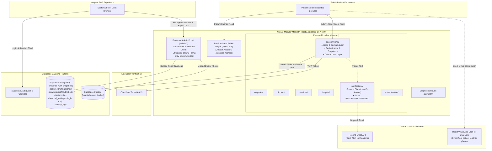
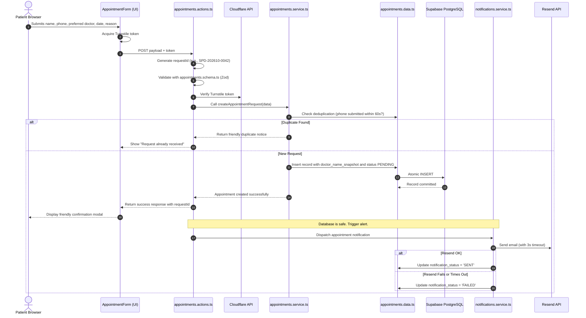
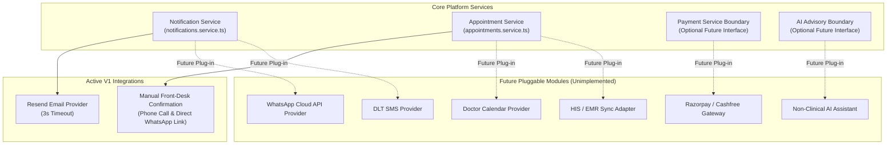

# System Architecture: Spandan Hospital Web Portal

> **Status:** Approved Architecture Specification (Reusable Hospital Digital Platform)  
> **Deployment Target:** Netlify (Commercial Free Tier)  
> **Backend & Storage:** Supabase (PostgreSQL + Auth + Storage)  
> **Project Layout:** Next.js Monolith with Feature Modules at Repository Root  
> **Architecture Paradigm:** Core Platform + Hospital Configuration + Optional Feature Modules (Single-Hospital V1 Deployment)

---

## 1. Overview & Architectural Principles

The application is engineered as a **Reusable Hospital Digital Platform**, deployed as a clean modular monolith for Spandan Hospital (a doctor-owned community hospital operated by two physicians) and maintained by a solo beginner developer.

### The Architectural Triad
The system strictly separates concerns into three layers:
$$\text{Hospital Portal} = \text{CORE PLATFORM} + \text{HOSPITAL CONFIGURATION} + \text{OPTIONAL FEATURE MODULES}$$

1. **CORE PLATFORM:** Reusable, hospital-agnostic platform infrastructure:
   - Public website framework (navigation, responsive layout, SEO metadata, accessible UI primitives)
   - Admin dashboard framework (metrics, data tables, status filters, search, CSV export)
   - Authentication & SSR cookie session management
   - Role-based authorization (`developer`, `hospital_admin`, `staff`, `doctor`) enforced via Supabase RLS
   - Enquiry management & phone deduplication
   - Appointment request pipeline & historical display name freezing (`doctor_name_snapshot`, `service_name_snapshot`)
   - Doctor roster & schedule models (`draft`, `published`, `archived`)
   - Services catalog & department models
   - Testimonial management & privacy filters
   - Hospital settings management engine
   - Notification dispatching engine (`PENDING`, `SENT`, `FAILED`)
   - Media storage pipeline with size/format validation (Supabase Storage)
   - Input validation (Zod schemas) & bot defense (Cloudflare Turnstile)
   - Error handling, health diagnostics (`/api/health`), and structured logging
   - Centralized design system (CSS variable tokens)
   *None of these core capabilities contain hardcoded Spandan-specific content.*

2. **HOSPITAL CONFIGURATION:** Hospital-specific content and visual identity:
   - Hospital name, logo, brand colors, tagline
   - Hero headlines, subtext, and hero imagery
   - Doctor rosters, qualifications, bios, consultation timings, and portraits
   - Services, clinical specialties, and department descriptions
   - Patient testimonials and featured reviews
   - Emergency phone numbers, front-desk numbers, and WhatsApp hotline
   - Physical address, Google Maps embed, and operating hours
   - Hospital photographs and infrastructure galleries
   - Homepage announcement banners
   *Rule:* All hospital specifics are treated as configuration, loaded from database tables (`hospital_settings`, `doctors`, `services`, etc.) or defined in centralized design tokens (`globals.css`), never hardcoded in React components.

3. **OPTIONAL FEATURE MODULES:** Independent future enhancements:
   - WhatsApp Cloud API automated notifications
   - SMS gateway alerts (DLT-compliant)
   - Online payment processing (Razorpay / Cashfree)
   - Doctor calendar integration & real-time slot booking
   - Patient self-service portal
   - Advanced operational analytics
   - AI-assisted administrative tooling (strictly non-clinical)
   - Hospital Information System (HIS) / EMR sync
   *Rule:* No speculative database tables or SDKs are added in V1.

### Single-Hospital V1 Scope (No Multi-Tenant SaaS)
- The initial deployment is strictly a **single-hospital deployment** for Spandan Hospital.
- **Explicitly Excluded from V1:**
  - No tenant routing or domain-based tenant resolvers
  - No tenant isolation middleware or multi-tenant database partitioning
  - No tenant billing or subscription management
  - No tenant switching mechanisms
  - No tenant super-administration dashboards
- Future hospital deployments will use this exact same repository and architecture as isolated, single-tenant instances with separate configuration and data.

### Future Reuse Principle
> **"Build reusable foundations, not speculative features."**  
> A capability becomes part of the core platform only when it is needed by the current product or is clearly reusable infrastructure required by multiple real features. Do not implement something only because it may be useful years later.

### Core Architectural Axioms
1. **Single Root Monolith:** Both the public portal and protected admin dashboard live directly at the repository root (`/app`, `/components`, `/features`, `/lib`, `/types`).
2. **Feature Module Boundaries (`/features/`):** Business logic is grouped into self-contained modules (`enquiries`, `appointments`, `doctors`, `services`, `testimonials`, `hospital`, `notifications`, `authentication`).
3. **Layered Separation of Concerns:** Strict single-directional flow: `UI -> Server Action -> Schema Validation -> Business Logic -> Data Access -> Supabase`.
4. **Static Generation & High Availability:** Public pages are pre-rendered with ISR. Standard patient visits do not trigger live PostgreSQL queries, keeping the site online even during database maintenance.
5. **Database as Single Source of Truth:** Atomic persistence in Supabase PostgreSQL precedes any notification dispatch.
6. **Simple Queue-Free Notifications:** Fire-and-record model: save record first (`PENDING`), dispatch Resend email with a 3-second timeout, update status to `SENT` or `FAILED`, allow manual retries from admin dashboard.
7. **No Direct Public REST Inserts:** Inbound submissions pass exclusively through Server Actions with Turnstile verification and Zod validation.
8. **Healthcare Data Minimization:** Collect only minimal operational appointment data; never collect medical records, diagnoses, or prescriptions.

---

## 2. Technology Stack

| Layer | Technology | Rationale & Commercial Alignment |
| :--- | :--- | :--- |
| **Framework** | Next.js (App Router, TypeScript) | Unified full-stack monolith: pre-rendered static pages, Server Actions, and authenticated dashboard routes. |
| **Hosting & CI/CD** | **Netlify** | Commercial-friendly free tier (avoids Vercel Hobby commercial restrictions), instant rollbacks, preview deploys. |
| **Styling & UI** | Tailwind CSS + Lucide Icons + Radix UI Primitives | Clean utility classes, accessible components, zero runtime CSS overhead, design token variables. |
| **Database** | Supabase PostgreSQL | Managed relational database with strong schemas, Row Level Security, and automated connection handling. |
| **Authentication** | Supabase Auth (SSR Cookie Sessions) | Secure cookie session handling for hospital staff without custom cryptography code. |
| **File Storage** | Supabase Storage (`hospital-assets`) | S3-compatible bucket for doctor photos and certificates (5 MB upload limit, public CDN). |
| **Bot / Spam Shield** | Cloudflare Turnstile | Free, privacy-friendly bot challenge with server-side validation. Zero annoying image puzzles for patients. |
| **Transactional Email** | Resend (Free Tier) | 3,000 emails/month free tier; clean REST API; used solely for desk notification alerts. |
| **Instant Messaging** | Standard `wa.me` Click-to-Chat | Free 1-tap browser links directly to the hospital WhatsApp phone; ₹0 monthly API costs. |

---

## 3. High-Level System Architecture Diagram



---

## 4. Ingestion Flow: UI, Business Logic & Data Separation

To ensure clean code without enterprise bloat, we follow a strict single-directional flow:



---

## 5. Repository & Directory Layout

```text
/
├── AGENTS.md                  # Permanent AI & developer operating rules
├── netlify.toml               # Netlify build & runtime configuration
├── package.json               # Root dependencies & scripts
├── tsconfig.json              # TypeScript configuration
├── tailwind.config.ts         # Tailwind design tokens & breakpoints
├── app/                       # Next.js App Router
│   ├── (public)/              # Public pages (Home, About, Doctors, Services, Contact, Book)
│   ├── (admin)/admin/         # Protected hospital admin dashboard routes
│   │   ├── dashboard/         # Metrics overview
│   │   ├── enquiries/         # Inbound requests pipeline & CSV export
│   │   ├── doctors/           # Doctor roster management
│   │   ├── services/          # Clinical department editor
│   │   ├── testimonials/      # Patient review approvals
│   │   ├── settings/          # Hospital phones, hours & announcement banner
│   │   ├── activity/          # Simple admin activity logs
│   │   └── login/             # Staff authentication
│   ├── api/
│   │   └── health/            # Diagnostic health check endpoint
│   └── globals.css            # Design token CSS variables
├── components/
│   ├── ui/                    # Reusable primitives (button, card, dialog, input, badge)
│   └── public/                # Marketing blocks (Hero, DoctorCard, ServiceCard, Footer)
├── features/                  # Business Feature Modules
│   ├── enquiries/             # Enquiries actions, data, schemas, services
│   ├── appointments/          # Appointment actions, data, schemas, services
│   ├── doctors/               # Doctor data, schemas, admin forms
│   ├── services/              # Service data, schemas, admin forms
│   ├── testimonials/          # Testimonial data, schemas, admin forms
│   ├── hospital/              # Settings data, schemas, banner forms
│   ├── notifications/         # Notification service & Resend provider
│   └── authentication/        # Auth actions, session helpers
├── lib/
│   ├── supabase/              # Browser client, Server client helpers
│   ├── config/
│   │   └── hospital.ts        # Fallback branding constants
│   └── utils/                 # Formatting, date helpers, request ID generator
├── types/                     # TypeScript database & operational interfaces
├── database/                  # SQL migrations and database documentation
│   └── migrations/            # 01_initial_schema.sql, 02_security_rls.sql, etc.
├── docs/                      # Architectural, security, and handover documentation
│   └── FUTURE-SCALABILITY.md  # Detailed extensibility & future roadmap guide
├── assets/                    # Raw assets, logos, and high-res photography
├── design/                    # UI mockups, palette notes, and design guidelines
└── references/                # Hospital background, clinic research, doctor CVs
```

---

## 6. Integration Boundaries & Service Isolation

External providers must be isolated behind clear, modular service boundaries so the core platform never binds directly to third-party vendor APIs:



### Boundary Isolation Principles:
1. **Notification Boundary:**
   - V1: `Notification Service -> Resend Email API` (3-second timeout, fire-and-record).
   - Future: `Notification Service -> Resend, WhatsApp, SMS`.
   - The UI forms and database tables remain completely unaware of which notification transport is active.
2. **Appointment Boundary:**
   - V1: `Appointment Service -> Manual Front-Desk Confirmation` (phone call, direct WhatsApp link).
   - Future: `Appointment Service -> Manual confirmation, Calendar, HIS`.
   - The public appointment booking request interface does not change when calendar or HIS integrations are added.
3. **Optional Payment Boundary:**
   - V1: No payments collected; appointments are booking requests.
   - Future: Pluggable checkout session adapter. No payment SDKs or tables in V1.
4. **Optional AI Boundary:**
   - V1: Completely offline; no AI dependencies.
   - Future: Advisory non-clinical assistant.
5. **System Resilience Guarantee:**
   - The core system must continue functioning normally if any optional external integration is unavailable, times out, or fails.

---

## 7. AI Boundary (Strict Non-Clinical Scope)

Future AI integration is strictly limited to an optional administrative layer:

### Permitted Future Administrative Use Cases:
- Enquiry categorization and department routing
- Content drafting assistance (hospital news, notices, health awareness posts)
- FAQ drafting and polishing
- Administrative operational summaries for front-desk handovers
- Public website search assistance for clinic timings and services

### Strictly Prohibited AI Capabilities:
> [!CAUTION]
> AI must **NEVER** be used for:
> - Medical diagnosis
> - Symptom triage or symptom checking
> - Treatment, therapy, or medication recommendations
> - Clinical decision-making or advice
> 
> The core hospital platform is 100% independent of AI. If AI services are disconnected or fail, every operational feature remains fully functional.

---

## 8. Centralized Design System Reusability

To ensure the core platform can be deployed for different clinics without rewriting UI components, visual styling is decoupled into centralized design tokens:

### Token Categories:
- **CSS Variables (`app/globals.css`):** Primary brand colors, secondary accents, alert colors, surface backgrounds, borders.
- **Typography Tokens (`tailwind.config.ts`):** Font families (Inter/sans), font weights, scale presets.
- **Color Tokens:** Semantic tokens (`bg-primary`, `text-primary-foreground`, `bg-secondary`, `bg-muted`).
- **Spacing & Radius Tokens:** Standardized layout radii (`--radius-sm`, `--radius-md`, `--radius-lg`) and padding increments.
- **Shadow Tokens:** Elevation levels (`shadow-sm`, `shadow-md`, `shadow-lg`).
- **Responsive Breakpoints:** Consistent mobile-first breakpoints (`sm: 640px`, `md: 768px`, `lg: 1024px`, `xl: 1280px`).

### Multi-Hospital Theming Model:
```text
Hospital A (Spandan)  ──>  Theme Tokens (Navy / Teal)    ──>  Reusable Component Library
Hospital B (Future)   ──>  Theme Tokens (Emerald / Gold) ──>  Reusable Component Library
```
Components consume semantic tokens instead of hardcoded hospital colors. Re-skinning requires updating CSS variables, not touching component code.

---

## 9. Content Governance Model

Hospital administrators and receptionists control **structured content**, while the development team maintains design and code:

| Content Area | Managed By Hospital Staff? | Interface / Tool |
| :--- | :--- | :--- |
| **Doctor profiles & OPD hours** | Yes | Structured admin form (`/admin/doctors`) |
| **Clinical services & facilities** | Yes | Structured admin form (`/admin/services`) |
| **Patient testimonials** | Yes (Approval/Feature) | Structured admin table (`/admin/testimonials`) |
| **Hospital contact numbers & hours**| Yes | Structured settings form (`/admin/settings`) |
| **Announcement banner** | Yes (Text & toggle) | Structured settings form (`/admin/settings`) |
| **Page layouts & templates** | **No** | Fixed in Next.js code by development team |
| **Custom HTML / CSS editing** | **No** | Strictly forbidden for stability and security |
| **Drag-and-drop page builders** | **No** | Not included; prevents visual breakage |

---

## 10. Future Extensibility & Roadmap Summary

1. **Multi-Hospital Reuse:** Single-tenant modular monolith. Independent repository deployments with tailored configuration and design tokens allow rapid delivery for subsequent clinics without SaaS multi-tenancy bloat.
2. **Feature Flags:** Future option only. No feature-flag system or `lib/config/features.ts` is created in V1.
3. **Future Reuse Principle:**
   > **"Build reusable foundations, not speculative features."**  
   > A feature becomes part of the core platform only when it is needed by the current product or is clearly reusable infrastructure required by multiple real features. Do not implement something only because it may be useful years later.
