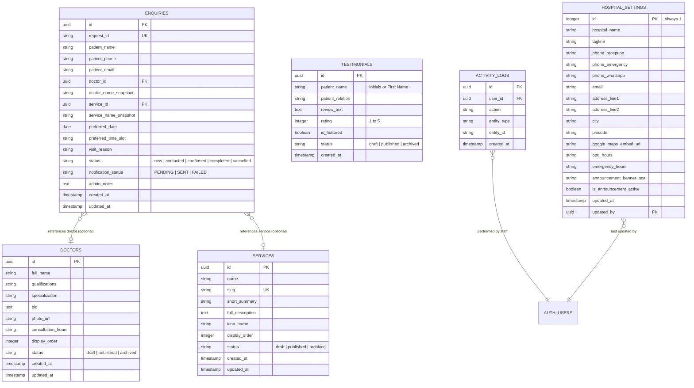

# Database Design & Schema Specification: Spandan Hospital

> **Status:** Approved Schema Specification (Future-Ready Relational Design)  
> **Database Engine:** Supabase PostgreSQL (Managed Relational Database)  
> **Security Model:** Strict Row Level Security (RLS) with No Direct Anonymous REST Inserts

---

## 1. Principles of Data Architecture

1. **Database as the Sole Source of Truth:**  
   Every patient appointment request must be persisted to Supabase PostgreSQL before external notification triggers execute.
2. **Strict Public Form Security (No Direct Anon REST Insert):**  
   Anonymous public visitors are **not** granted `INSERT` policies on the Supabase REST API for the `enquiries` table. Inbound appointments are ingested exclusively through a Next.js Server Action running on the application server. The Server Action validates Turnstile tokens, runs Zod schema checks, checks for duplicates, and writes via the server-side Supabase client.
3. **Healthcare Data Minimization:**  
   The database collects only minimal operational appointment details: patient name, phone, optional email, preferred doctor, preferred service, preferred date/time, and a brief `visit_reason`. It explicitly forbids medical records, diagnostic reports, prescriptions, or clinical notes.
4. **Historical Enquiry Integrity:**  
   Enquiries preserve foreign keys (`doctor_id`, `service_id`) alongside immutable display-name snapshots (`doctor_name_snapshot`, `service_name_snapshot`). Enquiries remain completely accurate and readable even if a doctor's profile is later edited, deactivated, or archived.
5. **Strongly Typed Hospital Settings:**  
   Hospital settings are stored in a single typed row (`hospital_settings`) with dedicated columns, eliminating fragile JSONB parsing.
6. **Simple Activity Logging:**  
   No enterprise JSON diff engine. A lightweight `activity_logs` table records staff actions (`user_id`, `action`, `entity_type`, `entity_id`, `created_at`).
7. **Content Lifecycle States:**  
   Publishable entities (doctors, services, testimonials) support standard lifecycle states: `draft`, `published`, `archived`.
8. **Future Extensibility Without Speculative Tables:**  
   Only entities required for V1 are created. No speculative tables are built for payments, AI prompts, or calendar sync. When future features are introduced, they will be applied incrementally via versioned SQL scripts in `/database/migrations/`.
9. **Data Access Isolation:**  
   Database queries are kept inside feature data files (e.g., `features/appointments/appointments.data.ts`), never mixed into UI components.

---

## 2. Entity Relationship Diagram (ERD)



---

## 3. Table Definitions & Column Specifications

### 3.1. `enquiries` (Appointment Requests & Patient Inquiries)
Captures patient appointment leads. Direct public REST access is disabled.

| Column | Type | Constraints | Description |
| :--- | :--- | :--- | :--- |
| `id` | `uuid` | `DEFAULT gen_random_uuid() PRIMARY KEY` | Internal database record ID |
| `request_id` | `text` | `UNIQUE NOT NULL` | Tracking reference (e.g., `SPD-202610-0042`) |
| `patient_name` | `text` | `NOT NULL` | Full name of patient |
| `patient_phone` | `text` | `NOT NULL` | Primary mobile number (+91 format) |
| `patient_email` | `text` | `NULL` | Optional patient email |
| `doctor_id` | `uuid` | `REFERENCES doctors(id) ON DELETE SET NULL` | Selected doctor reference (optional) |
| `doctor_name_snapshot` | `text` | `NULL` | Frozen doctor name at time of booking |
| `service_id` | `uuid` | `REFERENCES services(id) ON DELETE SET NULL` | Selected department reference (optional) |
| `service_name_snapshot` | `text` | `NULL` | Frozen service name at time of booking |
| `preferred_date` | `date` | `NULL` | Requested consultation date |
| `preferred_time_slot` | `text` | `NULL` | Preferred window (e.g., "Morning (10 AM - 1 PM)") |
| `visit_reason` | `text` | `NULL` | Brief non-clinical reason (e.g., "Routine Checkup") |
| `status` | `text` | `DEFAULT 'new' NOT NULL` | Pipeline status (`new`, `contacted`, `confirmed`, `completed`, `cancelled`) |
| `notification_status` | `text` | `DEFAULT 'PENDING' NOT NULL` | Delivery status: `PENDING`, `SENT`, `FAILED` |
| `admin_notes` | `text` | `NULL` | Operational notes added by reception desk |
| `created_at` | `timestamptz` | `DEFAULT now() NOT NULL` | Submission timestamp |
| `updated_at` | `timestamptz` | `DEFAULT now() NOT NULL` | Last status modification timestamp |

---

### 3.2. `doctors` (Medical Staff Roster)
Profiles of consulting physicians and directors.

| Column | Type | Constraints | Description |
| :--- | :--- | :--- | :--- |
| `id` | `uuid` | `DEFAULT gen_random_uuid() PRIMARY KEY` | Unique physician ID |
| `full_name` | `text` | `NOT NULL` | e.g., "Dr. Ramesh Patil" |
| `qualifications` | `text` | `NOT NULL` | e.g., "MBBS, MD (Internal Medicine)" |
| `specialization` | `text` | `NOT NULL` | e.g., "Critical Care & General Medicine" |
| `bio` | `text` | `NULL` | Clinical experience and summary |
| `photo_url` | `text` | `NULL` | Public asset URL from Supabase Storage |
| `consultation_hours` | `text` | `NOT NULL` | e.g., "Mon - Sat: 10:00 AM - 1:00 PM" |
| `display_order` | `integer` | `DEFAULT 0 NOT NULL` | Ordering rank for website display |
| `status` | `text` | `DEFAULT 'published' NOT NULL` | Content state: `draft`, `published`, `archived` |
| `created_at` | `timestamptz` | `DEFAULT now() NOT NULL` | Record creation timestamp |
| `updated_at` | `timestamptz` | `DEFAULT now() NOT NULL` | Record update timestamp |

---

### 3.3. `services` (Clinical Specialties & Facilities)
Hospital departments and diagnostic offerings.

| Column | Type | Constraints | Description |
| :--- | :--- | :--- | :--- |
| `id` | `uuid` | `DEFAULT gen_random_uuid() PRIMARY KEY` | Department ID |
| `name` | `text` | `NOT NULL` | Department name (e.g., "Pediatrics") |
| `slug` | `text` | `UNIQUE NOT NULL` | URL slug (e.g., "pediatrics") |
| `short_summary` | `text` | `NOT NULL` | 1-2 sentence card summary |
| `full_description` | `text` | `NULL` | Extended department description |
| `icon_name` | `text` | `NULL` | Lucide icon identifier (e.g., "baby") |
| `display_order` | `integer` | `DEFAULT 0 NOT NULL` | UI sort order |
| `status` | `text` | `DEFAULT 'published' NOT NULL` | Content state: `draft`, `published`, `archived` |
| `created_at` | `timestamptz` | `DEFAULT now() NOT NULL` | Creation timestamp |
| `updated_at` | `timestamptz` | `DEFAULT now() NOT NULL` | Modification timestamp |

---

### 3.4. `testimonials` (Curated Patient Feedback)
Patient feedback approved for public display.

| Column | Type | Constraints | Description |
| :--- | :--- | :--- | :--- |
| `id` | `uuid` | `DEFAULT gen_random_uuid() PRIMARY KEY` | Testimonial ID |
| `patient_name` | `text` | `NOT NULL` | First name or initials (e.g., "Ramesh P.") |
| `patient_relation` | `text` | `NULL` | General relation (e.g., "OPD Patient") |
| `review_text` | `text` | `NOT NULL` | Patient review text |
| `rating` | `integer` | `DEFAULT 5 CHECK (rating >= 1 AND rating <= 5)` | 1 to 5 star rating |
| `is_featured` | `boolean` | `DEFAULT false NOT NULL` | Highlighted on homepage hero |
| `status` | `text` | `DEFAULT 'draft' NOT NULL` | Content state: `draft`, `published`, `archived` |
| `created_at` | `timestamptz` | `DEFAULT now() NOT NULL` | Feedback entry timestamp |

---

### 3.5. `hospital_settings` (Single Typed Configuration Row)
Strongly typed hospital-wide contact and operational parameters. Exactly one row exists (`id = 1`).

| Column | Type | Constraints | Description |
| :--- | :--- | :--- | :--- |
| `id` | `integer` | `PRIMARY KEY CHECK (id = 1)` | Singleton identifier |
| `hospital_name` | `text` | `NOT NULL` | Official hospital title |
| `tagline` | `text` | `NOT NULL` | Primary marketing motto |
| `phone_reception` | `text` | `NOT NULL` | Front desk phone number |
| `phone_emergency` | `text` | `NOT NULL` | 24/7 emergency hotline |
| `phone_whatsapp` | `text` | `NOT NULL` | WhatsApp click-to-chat mobile number |
| `email` | `text` | `NOT NULL` | Official hospital inbox address |
| `address_line1` | `text` | `NOT NULL` | Street / Building address |
| `address_line2` | `text` | `NULL` | Landmark or area |
| `city` | `text` | `NOT NULL` | City name |
| `pincode` | `text` | `NOT NULL` | Postal PIN code |
| `google_maps_embed_url`| `text` | `NOT NULL` | Google Maps iframe embed URL |
| `opd_hours` | `text` | `NOT NULL` | e.g., "Mon - Sat: 9:00 AM - 8:00 PM" |
| `emergency_hours` | `text` | `NOT NULL` | e.g., "24 Hours / 7 Days Open" |
| `announcement_banner_text` | `text` | `NULL` | Alert banner text (e.g., "Camp Notice") |
| `is_announcement_active` | `boolean` | `DEFAULT false NOT NULL` | Toggle banner visibility |
| `updated_at` | `timestamptz` | `DEFAULT now() NOT NULL` | Last update timestamp |
| `updated_by` | `uuid` | `REFERENCES auth.users(id)` | Admin who updated settings |

---

### 3.6. `activity_logs` (Lightweight Admin Activity Log)
Minimal operational tracking without heavy JSON diffing.

| Column | Type | Constraints | Description |
| :--- | :--- | :--- | :--- |
| `id` | `uuid` | `DEFAULT gen_random_uuid() PRIMARY KEY` | Log entry ID |
| `user_id` | `uuid` | `REFERENCES auth.users(id)` | Authenticated staff user |
| `action` | `text` | `NOT NULL` | Action code (e.g., `STATUS_UPDATE`, `DOCTOR_EDIT`) |
| `entity_type` | `text` | `NOT NULL` | Target model (`enquiry`, `doctor`, `service`, `settings`) |
| `entity_id` | `text` | `NOT NULL` | Identifier of affected record |
| `created_at` | `timestamptz` | `DEFAULT now() NOT NULL` | Action timestamp |

---

## 4. Row Level Security (RLS) Policy Specifications

Every table has Row Level Security enabled.

```sql
-- 1. ENQUIRIES TABLE
ALTER TABLE enquiries ENABLE ROW LEVEL SECURITY;

-- CRITICAL DECISION: Public Anon role has NO INSERT or SELECT permissions over REST API.
-- Public submissions are processed solely via Next.js Server Action using the server client.

-- Authenticated Staff can view and update enquiries
CREATE POLICY "Staff can view enquiries" 
ON enquiries FOR SELECT 
TO authenticated 
USING (true);

CREATE POLICY "Staff can update enquiries" 
ON enquiries FOR UPDATE 
TO authenticated 
USING (true);

-- 2. PUBLIC CONTENT TABLES (Doctors, Services, Testimonials)
ALTER TABLE doctors ENABLE ROW LEVEL SECURITY;
ALTER TABLE services ENABLE ROW LEVEL SECURITY;
ALTER TABLE testimonials ENABLE ROW LEVEL SECURITY;

-- Public can SELECT only published items
CREATE POLICY "Public read published doctors" 
ON doctors FOR SELECT 
TO anon 
USING (status = 'published');

CREATE POLICY "Public read published services" 
ON services FOR SELECT 
TO anon 
USING (status = 'published');

CREATE POLICY "Public read published testimonials" 
ON testimonials FOR SELECT 
TO anon 
USING (status = 'published');

-- Authenticated staff have full management access
CREATE POLICY "Staff full access on doctors" 
ON doctors FOR ALL 
TO authenticated 
USING (true);

CREATE POLICY "Staff full access on services" 
ON services FOR ALL 
TO authenticated 
USING (true);

CREATE POLICY "Staff full access on testimonials" 
ON testimonials FOR ALL 
TO authenticated 
USING (true);

-- 3. HOSPITAL SETTINGS TABLE
ALTER TABLE hospital_settings ENABLE ROW LEVEL SECURITY;

-- Public can read hospital settings
CREATE POLICY "Public read hospital settings" 
ON hospital_settings FOR SELECT 
TO anon 
USING (true);

-- Only authenticated staff can update settings
CREATE POLICY "Staff update hospital settings" 
ON hospital_settings FOR UPDATE 
TO authenticated 
USING (true);

-- 4. ACTIVITY LOGS TABLE
ALTER TABLE activity_logs ENABLE ROW LEVEL SECURITY;

CREATE POLICY "Staff view activity logs" 
ON activity_logs FOR SELECT 
TO authenticated 
USING (true);

CREATE POLICY "Staff insert activity logs" 
ON activity_logs FOR INSERT 
TO authenticated 
WITH CHECK (true);
```

---

## 5. Free-Tier Database Management & Backups

1. **Supabase Free Tier Thresholds:**  
   - 500 MB PostgreSQL database capacity (sufficient for ~250,000 text appointment records).  
   - 1 GB file storage (adequate for 200+ optimized doctor portraits at ~500 KB each).  
   - Projects automatically pause after **7 consecutive days of zero database activity**.
2. **Preventing Inactivity Pauses:**  
   The health check route (`/api/health`) or routine hospital desk logins maintain active status.
3. **Data Export & Backup Procedure:**  
   - The Admin Dashboard includes a **"Download Enquiries CSV"** button for reception desk record-keeping.  
   - Developer backup: In the Supabase Dashboard, developers can run a manual SQL dump or export tables via Table Editor to CSV.  
   - **Data Privacy Rule:** Never commit patient data, phone numbers, or exported CSV files into the Git repository.
