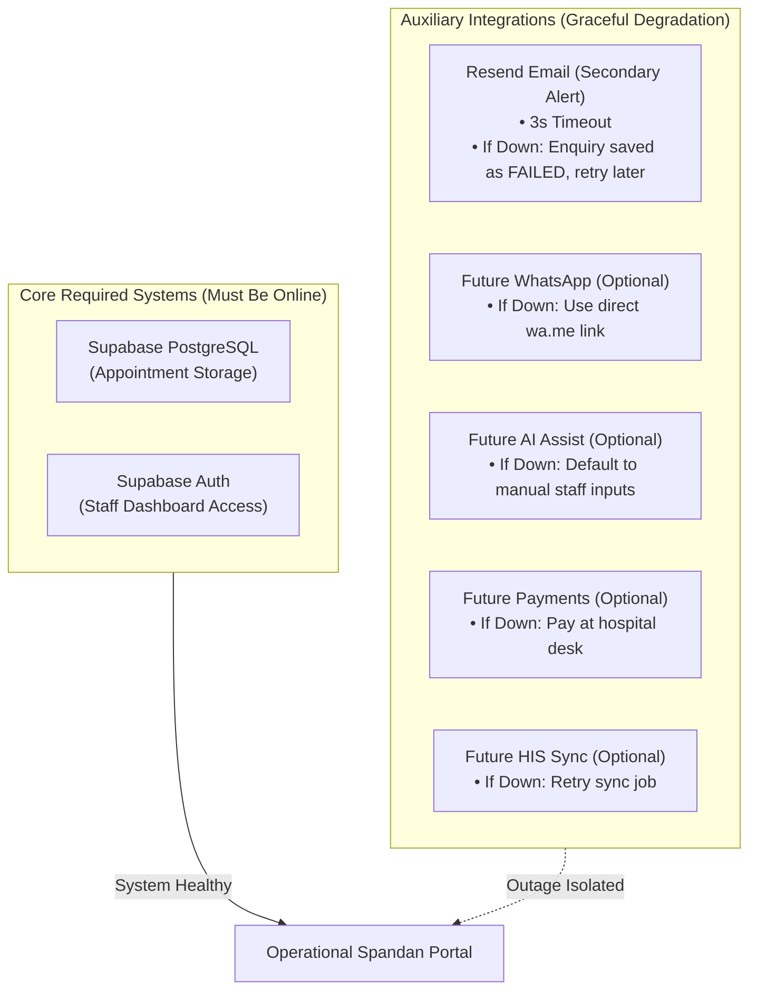

# Failure Modes & Recovery Playbook: Spandan Hospital Web

> **Status:** Approved Failure Recovery Playbook (Graceful Degradation Design)  
> **Hosting Environment:** Netlify  
> **Core Mandate:** The core hospital system must never fail due to an optional integration outage. Submissions are persisted first, and every component degrades gracefully.

---

## 1. Reliability Philosophy: Required vs. Optional Systems

The application distinguishes strictly between critical infrastructure and auxiliary integrations:

### Core Invariants:
1. **Defensive Persistence First:** Inbound appointments are committed to Supabase before any external API is contacted.
2. **Strict Timeouts (No Hanging Forms):** The notification dispatcher enforces a **3-second timeout** on email sending. The patient's browser receives confirmation immediately regardless of network delays.
3. **Transparent Recovery:** When an email fails, the dashboard flags the record as `FAILED` and provides a 1-click **"Retry Notification"** button.
4. **Static Reliability:** Marketing pages use Static Site Generation (SSG) / ISR, remaining 100% accessible to patients even if the database is temporarily paused.

---

## 2. Failure Matrix & Safeguards

| Failure Scenario | Immediate System Behavior | Patient Experience | Recovery / Mitigation Playbook |
| :--- | :--- | :--- | :--- |
| **Email Service Outage (Resend failure/timeout)** | 1. DB insertion completes successfully. 2. Email attempt catches error or times out at 3s. 3. Record updated to `notification_status: 'FAILED'`. | Sees successful confirmation screen with tracking ID within ~1.5s. | Front desk staff sees badge in admin dashboard: `Notification: FAILED`. Staff can click **"Retry Notification"** or process the appointment directly from the dashboard. |
| **Duplicate Submissions** | Client disables submit button on first click; Server Action checks for duplicate `(patient_phone, created_at within 60s)`. | Friendly notice: *"Your appointment request was already received."* | Deduplication logic prevents duplicate alerts and database clutter without displaying cryptic errors. |
| **Supabase Database Paused (7-Day Inactivity on Free Tier)** | Server Action catches database connection error. Logs diagnostic context with `requestId`. | Friendly message: *"Our system is temporarily busy. Please call our 24/7 desk directly at [Emergency Phone]."* | 1. Open Supabase Dashboard and click **"Restore Project"**. 2. Marketing pages stay online because they are statically pre-rendered on Netlify. |
| **Bot / Spam Flood** | Cloudflare Turnstile token validation fails on server. | Submission rejected with *"Verification failed. Please refresh."* | Server Action halts spam scripts before database writes occur. No junk records are saved. |
| **Invalid Form Inputs** | Server-side Zod validation flags incorrect phone format or missing fields. | Form highlights invalid fields with red helper text. | Patient corrects input without losing entered details. |
| **Staff Auth Failure / Password Forgotten** | Supabase Auth denies invalid credentials or expired session. | Clear message: *"Invalid email or password."* | Use built-in Supabase password reset flow or reset password directly via Supabase Auth dashboard. |
| **Accidental Content Mistake** | Staff accidentally alters a doctor profile or service. | Content workflow supports `draft`, `published`, `archived` states. | Staff toggles status to `draft` or `archived` to hide the mistake immediately while correcting the text. |
| **Doctor Photo Upload Failure** | Upload to Supabase Storage fails due to file size (> 5 MB) or network timeout. | Admin form displays: *"Upload failed: file exceeds 5MB or network timed out."* | Doctor record can still be saved without photo; staff can re-upload an optimized JPEG/PNG. |
| **Broken Deployment / Code Bug** | Build error on Netlify or unhandled runtime bug. | Global error boundary displays fallback page with direct hospital phone numbers. | Developer clicks **"Rollback to Previous Deployment"** in Netlify dashboard in 30 seconds. |

---

## 3. Step-by-Step Recovery Procedures

### Scenario A: Inbound Email Notifications Stop Arriving
**Symptoms:** Front desk reports they have not received email alerts for new patient appointments.

**Diagnosis Steps:**
1. Open Admin Dashboard at `/admin/enquiries`. Check if new patient submissions appear in the list.
   - If *Yes*: The database is healthy. Only the email notification channel is affected.
   - If *No*: Check website public form and database connectivity.
2. Check the `Notification Status` badge in the dashboard:
   - `PENDING`: Email is in progress or timed out.
   - `SENT`: Email was accepted by Resend. Check desk inbox spam/junk folder.
   - `FAILED`: Email dispatch failed.
3. Log in to [resend.com](https://resend.com) to view delivery logs, quota usage, or DNS status.

**Resolution:**
- Click **"Retry Notification"** next to the failed enquiry in the dashboard.
- If Resend free tier monthly limit (3,000 emails) was reached, upgrade or update recipient inbox.

---

### Scenario B: Database Inactivity Pause (Supabase Free Tier)
**Symptoms:** Appointment submissions return a server error, while public pages load normally.

**Diagnosis Steps:**
1. Visit `/api/health` in your browser. If database reports `disconnected`, Supabase may be paused.
2. Log in to [supabase.com/dashboard](https://supabase.com/dashboard).
3. If project shows "Paused", click **"Restore Project"**. Restoring takes approximately 1 to 2 minutes.

**Resolution:**
- Ensure hospital staff log in periodically or use a scheduled ping to keep the project active.

---

### Scenario C: Production Deployment Crash on Netlify
**Symptoms:** Website returns a 500 error or blank screen after a Git push.

**Diagnosis Steps:**
1. Open Netlify Dashboard > **Deploys**.
2. View the latest deploy log for build errors, missing environment variables, or TypeScript failures.

**Resolution:**
1. **Immediate Rollback:** Under Netlify **Deploys**, find the last green deploy and click **"Publish deploy"**. The site is restored in seconds.
2. Reproduce the bug locally with `npm run build` and fix the code before pushing again.

---

### Scenario D: Data Export & Disaster Recovery
**Symptoms:** Hospital administration requests an offline copy of all patient enquiries or requires a data snapshot.

**Procedure:**
1. In the Admin Dashboard under `/admin/enquiries`, click **"Export to CSV"**.
2. Save the CSV file securely on the hospital computer.
3. **Security Rule:** Never commit exported patient CSV files into the Git repository.
