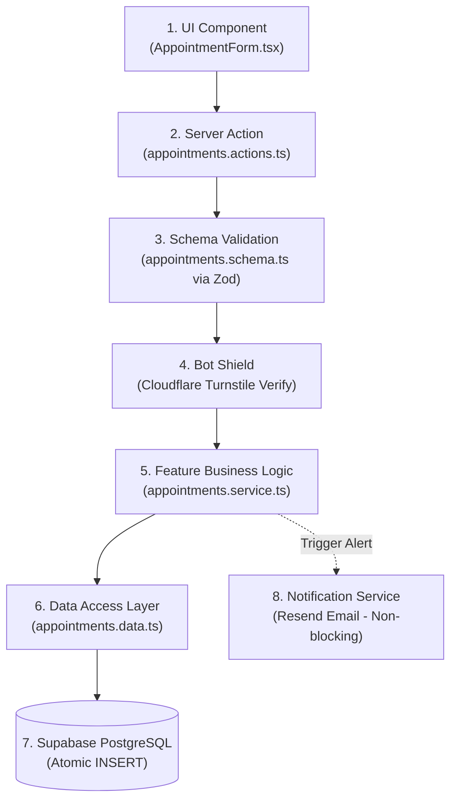
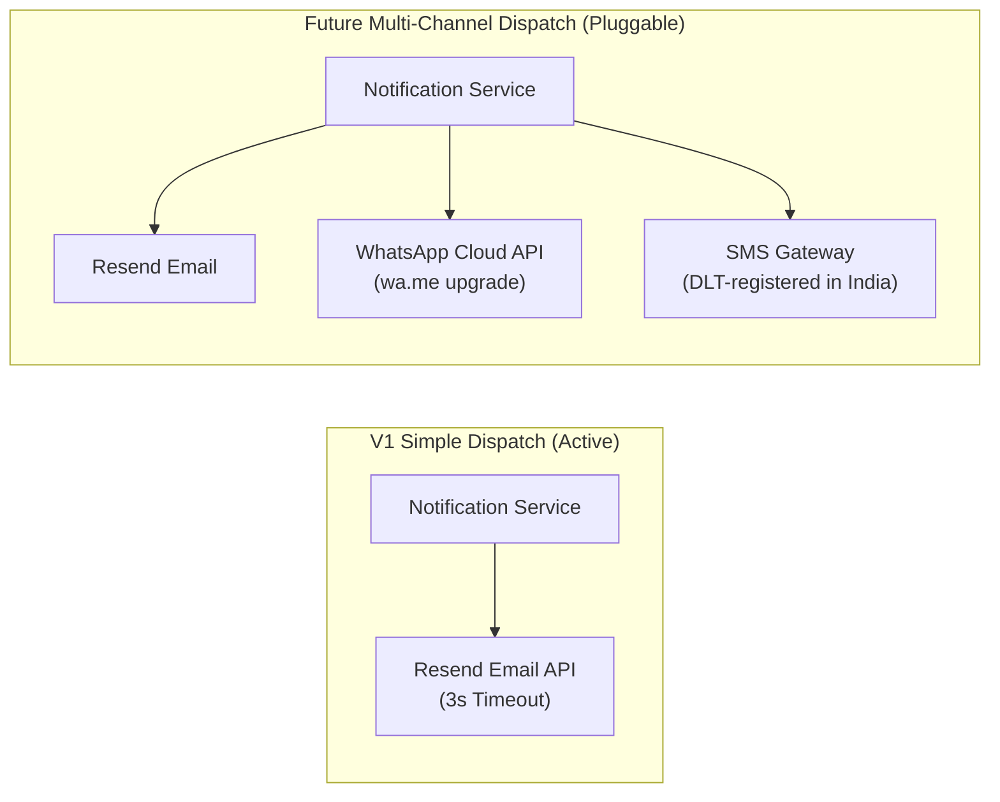
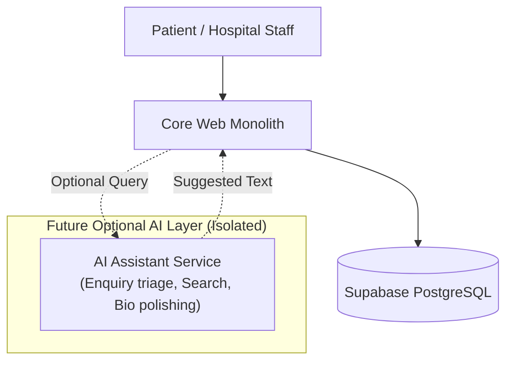

# Future Scalability & Architecture Extensibility Guide

> **Target:** Spandan Hospital Web Portal  
> **Philosophy:** Build a clean, beginner-friendly Modular Monolith for V1 while establishing clear architectural boundaries that allow seamless future growth without rewrites.  
> **Golden Rule:** Do NOT build speculative features in V1. Build clean boundaries today; add features when requested tomorrow.

---

## 1. Architectural Vision: Modular Monolith

Spandan Hospital is a small, doctor-owned hospital (two operating doctors). An enterprise microservice architecture or distributed service mesh would be fatal to solo-developer maintainability and commercial viability.

Instead, the system is designed as a **Modular Monolith**:
- Everything runs inside a single Next.js application at the repository root.
- Code is segregated into distinct, self-contained **feature modules** inside `/features`.
- Each feature module owns its data access, validation, business logic, and UI components.
- Shared primitives live in `/components/ui` and `/lib`.
- There are **no enterprise abstractions**: no generic repository factories, no universal CRUD engines, no dependency injection containers, and no microservices. Simple functions and explicit files are used throughout.

---

## 2. Business Module Boundaries

The application is structured into 8 distinct business modules inside `/features`:

```text
features/
├── enquiries/          # Patient general enquiries and contact messages
│   ├── enquiries.actions.ts      # Server Actions (form handling entry points)
│   ├── enquiries.data.ts         # Supabase database queries and inserts
│   ├── enquiries.schema.ts       # Zod validation schemas
│   ├── enquiries.service.ts      # Business logic (deduplication, snapshot creation)
│   └── components/               # EnquiryTable, EnquiryStatusBadge, EnquiryNotesModal
│
├── appointments/       # Patient appointment booking requests
│   ├── appointments.actions.ts   # Server Actions (booking submission)
│   ├── appointments.data.ts      # Database queries for appointment pipeline
│   ├── appointments.schema.ts    # Zod validation (visit_reason, slot, date)
│   ├── appointments.service.ts   # Booking logic, snapshot freezing
│   └── components/               # AppointmentForm, AppointmentRoster, CsvExportButton
│
├── doctors/            # Medical staff roster & OPD schedules
│   ├── doctors.data.ts           # Fetching active doctors, updating hours/bio
│   ├── doctors.schema.ts         # Zod validation for doctor profile editing
│   ├── doctors.service.ts        # Roster ordering, draft/published status checks
│   └── components/               # DoctorCard, DoctorGrid, DoctorAdminForm
│
├── services/           # Clinical specialties and hospital facilities
│   ├── services.data.ts          # Department queries, slug lookups
│   ├── services.schema.ts        # Department edit validation
│   ├── services.service.ts       # Status lifecycle (draft/published/archived)
│   └── components/               # ServiceCard, ServiceGrid, ServiceAdminForm
│
├── testimonials/       # Curated patient reviews
│   ├── testimonials.data.ts      # Approved testimonial queries
│   ├── testimonials.schema.ts    # Review validation schemas
│   ├── testimonials.service.ts   # Privacy filtering (anonymizing names to initials)
│   └── components/               # TestimonialCarousel, TestimonialAdminTable
│
├── hospital/           # Hospital operational settings & announcement banner
│   ├── hospital.data.ts          # Reads & writes to single-row hospital_settings
│   ├── hospital.schema.ts        # Validation for phones, hours, banner text
│   ├── hospital.service.ts       # Contact phone formatting, banner state
│   └── components/               # EmergencyBanner, ContactSection, SettingsAdminForm
│
├── notifications/      # Transactional alert dispatchers
│   ├── notifications.service.ts  # Notification orchestrator (fire-and-record)
│   ├── notifications.data.ts     # Update notification status (PENDING/SENT/FAILED)
│   └── providers/                # Email provider (Resend)
│       └── resend.provider.ts    # Direct Resend API dispatcher with 3s timeout
│
└── authentication/     # Staff and admin authentication
    ├── auth.actions.ts           # Login, logout Server Actions
    ├── auth.service.ts           # Role verification helpers (developer, hospital_admin, staff)
    └── components/               # LoginForm, ProtectedLayout
```

---

## 3. UI / Business Logic / Data Separation

To ensure a solo beginner developer can easily maintain and debug the application, UI components must never contain direct database queries or complex SQL.

### Preferred Ingestion Flow


### Responsibility Breakdown
1. **UI (`components/`):** Collects user input, displays feedback and loading spinners. Zero database code.
2. **Server Action (`*.actions.ts`):** Entry point running on the server. Extracts form payload, catches errors, returns friendly user messages and request IDs.
3. **Validation (`*.schema.ts`):** Strictly typed Zod schemas. Guarantees sanitization and enforces minimal data collection.
4. **Service / Business Logic (`*.service.ts`):** Enforces business rules (e.g., 60-second duplicate submission check, freezing `doctor_name_snapshot`, assigning `SPD-` tracking IDs).
5. **Data Access (`*.data.ts`):** Isolated Supabase SQL queries using the server client. If table columns change, only this file is updated.

---

## 4. Notification Integration Boundary

### V1 Reality (Simple & Queue-Free)
There is **no Redis, Kafka, RabbitMQ, or external worker**. The system follows a **fire-and-record** model:
1. Appointment is safely committed to Supabase PostgreSQL first.
2. `notification_status` is marked as `PENDING`.
3. The Server Action invokes `notifications.service.sendAppointmentAlert()` with a strict **3-second timeout**.
4. If Resend responds OK within 3s → status updated to `SENT`.
5. If Resend times out, errors, or fails → status updated to `FAILED`.
6. Patient receives an immediate success response regardless of email outcome.
7. Staff can click **"Retry Notification"** in the dashboard at any time.



### Future Extensibility
When the hospital decides to invest in paid automated SMS or WhatsApp Business API alerts:
- A new file `features/notifications/providers/whatsapp.provider.ts` is added.
- `notifications.service.ts` calls both adapters.
- **The core appointment form and database schema require zero rewriting.**

---

## 5. Future Payment Boundary

V1 does **not** collect payments. Appointments are booking requests confirmed by the front desk over the phone.

### Future Architecture Interface
When online consultation deposits or OPD registration fees are introduced:
```text
Appointment Request
       ↓
Optional Payment Gateway (Razorpay / Cashfree)
       ↓
Webhook Verification
       ↓
Update Enquiry Status: 'confirmed' (payment_status: 'paid')
```
- **Boundary:** An `appointments.payment.ts` handler can be plugged into the appointment service without altering public forms or doctor rosters.
- **V1 Action:** Do NOT install Razorpay or Stripe SDKs now.

---

## 6. Future AI Boundary

AI is strictly an **optional advisory module**. It must **never** be a core system dependency.



### Future Scope & Strict Medical Boundary (Post-V1)
> [!CAUTION]
> **Strict Medical Boundary:** AI must **NEVER** be used for medical diagnosis, symptom triage, clinical assessment, treatment recommendations, or medical decision-making. 

Future optional AI use cases are strictly administrative and supportive:
- General enquiry categorization (e.g., routing contact requests to desk or OPD)
- Content drafting (e.g., assisting doctors with profile biographies or clinic descriptions)
- FAQ drafting and polishing
- Administrative summaries for front desk management
- Website search assistance for finding hospital services and timings

### Architectural Rule
If any future AI API times out, throws errors, or is disabled:
- Appointments **still work**.
- Enquiries **still work**.
- Admin dashboard **still works**.
- Public website **remains 100% online**.

---

## 7. Future Hospital Information System (HIS) Integration

V1 operates completely standalone. Most small 2-doctor community clinics in India manage OPD via physical registers or simple desk Excel sheets.

### Conceptual Future Integration Layer
```text
Spandan Hospital Platform
          ↓
Integration Adapter Layer (features/integrations/his.adapter.ts)
          ↓
External Hospital HIS / EMR / Lab Reporting System
```
- When the hospital adopts an external HIS, an outbound webhook or scheduled sync script reads confirmed appointments from Supabase and pushes them to the HIS.
- V1 is completely decoupled from any vendor-specific EMR format.

---

## 8. Multi-Hospital Reusability Strategy

While this project is built exclusively for Spandan Hospital, the architecture is designed so the solo developer can deliver a similar portal for **Hospital B** in the future in just a few hours.

### How Reusability Works (Without SaaS Multi-Tenancy Complexity)
1. **Single-Tenant Repositories:** Keep each hospital as an independent, isolated deployment. Avoid multi-tenant database partitioning, shared databases, or cross-tenant data leakage risks.
2. **Configurable Branding:** All hospital names, director quotes, phone numbers, and addresses live in `hospital_settings` and `lib/config/hospital.ts`.
3. **Design Tokens:** Primary colors, secondary accents, and fonts are controlled via CSS variables in `globals.css` and `tailwind.config.ts`.
4. **Instant Duplication:** Fork repository, update 5 branding tokens, execute standard database migrations in `/database/migrations/`, deploy to Netlify.

---

## 9. Design System & Design Tokens Strategy

Branding colors and typography must never be hardcoded across components.

### Token Architecture
```css
/* app/globals.css */
:root {
  /* Brand Tokens */
  --brand-primary: 215 80% 28%;      /* Deep Trust Navy */
  --brand-secondary: 178 78% 38%;    /* Medical Teal / Cyan */
  --brand-accent: 199 89% 48%;       /* Action Blue */
  --brand-emergency: 0 84% 60%;      /* Emergency Alert Red */

  /* Neutral Surface Tokens */
  --background: 0 0% 100%;
  --foreground: 222 47% 11%;
  --muted: 210 40% 96%;
  --muted-foreground: 215 16% 47%;
  --card: 0 0% 100%;
  --border: 214 32% 91%;

  /* Layout Tokens */
  --radius-sm: 0.375rem;
  --radius-md: 0.5rem;
  --radius-lg: 0.75rem;
}
```

### Rules:
- Components use semantic Tailwind classes: `bg-primary`, `text-primary-foreground`, `border-border`.
- To re-skin the website for another hospital with green/gold branding, the developer changes only 3 CSS variable definitions in `globals.css`.

---

## 10. Feature Flags Strategy (Future Option — Not Built in V1)

**V1 Status:** No feature-flag system or `lib/config/features.ts` is created for V1. The initial product has a lean, fixed V1 feature boundary.

If future feature additions eventually require runtime toggling, a lightweight, zero-dependency configuration object can be introduced without external SaaS services:

```typescript
// Future conceptual option (Do NOT create in V1)
// lib/config/features.ts
export const FEATURE_FLAGS = {
  appointmentRequests: true,
  publicEnquiries: true,
  doctorRoster: true,
  servicesCatalog: true,
  testimonials: true,
  
  // Future experimental additions
  onlinePayments: false,
  automatedWhatsAppApi: false,
  smsNotifications: false,
  patientPortal: false,
  aiAssistant: false,
} as const;
```
- For V1, keep the application minimal and do not build this abstraction prematurely.

---

## 11. Application Semantic Versioning

The project uses clean Semantic Versioning (`MAJOR.MINOR.PATCH`) tracked via Git tags:

| Version Type | When to Increment | Example |
| :--- | :--- | :--- |
| **PATCH (`1.0.x`)** | Bug fixes, typo corrections, styling tweaks, minor copy changes that do not alter database schemas or workflows. | `v1.0.1` (fix mobile drawer padding) |
| **MINOR (`1.x.0`)** | Adding new backwards-compatible capabilities, adding a new public section, CSV export enhancements, or new admin filters. | `v1.1.0` (add CSV export feature) |
| **MAJOR (`x.0.0`)** | Breaking changes, database restructuring, introduction of online payments, patient portal accounts, or complete architectural shifts. | `v2.0.0` (launch of Patient Portal) |

---

## 12. Solo-Developer Maintainability: "Where is X?" Guide

Whenever you or another developer need to find or modify code, use this direct map:

| Question | File / Directory Location |
| :--- | :--- |
| **Where is the appointment booking logic?** | `features/appointments/appointments.service.ts` |
| **Where is public form validation?** | `features/appointments/appointments.schema.ts` |
| **Where are the database queries?** | `features/<feature-name>/<feature-name>.data.ts` |
| **Where is staff authentication?** | `features/authentication/` & `lib/supabase/` |
| **Where are notification dispatchers?** | `features/notifications/providers/resend.provider.ts` |
| **Where are external service credentials?** | Netlify Site Settings & `.env.local` |
| **Where are feature flags?** | Future option only; not built in V1 (see `docs/FUTURE-SCALABILITY.md`) |
| **Where are database migrations?** | `database/migrations/` |
| **Where are branding colors & fonts?** | `app/globals.css` & `tailwind.config.ts` |
| **How do I test a build locally?** | Run `npm run build` in terminal |
| **How do I deploy?** | Push to `main` branch on GitHub; Netlify builds automatically |
| **How do I roll back a broken deploy?** | In Netlify Dashboard > **Deploys**, click previous deploy > **Publish deploy** |
| **How do I troubleshoot production issues?** | Check `docs/TROUBLESHOOTING.md` & visit `https://spandanhospital.in/api/health` |
