# Implementation Plan: Spandan Hospital Web Project

> **Status:** Approved Implementation Roadmap (Reusable Hospital Digital Platform)  
> **Target:** High-trust public website and lightweight admin dashboard for ~₹30,000 commercial package  
> **Hosting Target:** Netlify (Commercial Free Tier)  
> **App Location:** Repository Root with Feature Modules  
> **Architecture Paradigm:** Core Platform + Hospital Configuration + Optional Feature Modules (Single-Hospital V1 Deployment)

---

## Phased Implementation Roadmap

```mermaid
flowchart LR
    Phase0["Phase 0:<br/>Documentation & Audit<br/>(COMPLETED)"] --> Phase1["Phase 1:<br/>Root Scaffold & Design System"]
    Phase1 --> Phase2["Phase 2:<br/>Public Marketing Pages (Static/ISR)"]
    Phase2 --> Phase3["Phase 3:<br/>Supabase Schema & RLS Setup"]
    Phase3 --> Phase4["Phase 4:<br/>Secure Server Action Form Flow"]
    Phase4 --> Phase5["Phase 5:<br/>Hospital Admin Dashboard"]
    Phase5 --> Phase6["Phase 6:<br/>Resend Notifications & Resilience"]
    Phase6 --> Phase7["Phase 7:<br/>Netlify Deployment & Handover"]
```

---

### Phase 0: Inspection, Architecture Audit & Alignment (Completed)
- [x] Inspect project directory structure and check existing files.
- [x] Establish permanent project operating rules (`AGENTS.md`).
- [x] Draft and finalize system architecture, database schema, security policy, failure recovery, deployment, troubleshooting, and handover guides (`/docs/`).
- [x] Conduct architecture audit against real constraints (two-doctor hospital, beginner solo developer, ₹30,000 package, free-tier tech).
- [x] Incorporate all approved architectural decisions into project documentation.
- [x] Formulate **Reusable Hospital Digital Platform** architecture:
  - **Core Platform:** Reusable public/admin frameworks, auth, enquiries, appointments, rosters, settings, notifications, storage, validation.
  - **Hospital Configuration:** Decoupled client content (`hospital_settings`, seed files) and design tokens.
  - **Optional Feature Modules:** Documented future boundaries (WhatsApp, payments, calendar, AI, HIS) with zero speculative code or tables in V1.
  - **Future Reuse Principle:** "Build reusable foundations, not speculative features."
  - **Single-Hospital V1 Scope:** No multi-tenant SaaS machinery.
- [x] Define future-ready modular boundaries and scalability roadmap (`/docs/FUTURE-SCALABILITY.md`).

---

### Phase 1: Project Scaffolding & Design Foundation
*Objective: Set up a clean, minimal Next.js TypeScript project at repository root with Tailwind CSS, design tokens, and base UI components decoupled from hardcoded hospital branding.*
- Initialize Next.js project with App Router, TypeScript, ESLint, and Tailwind CSS directly at **repository root**.
- Configure `netlify.toml` for Netlify Next.js runtime build.
- Establish clean directory hierarchy:
  - `app/` (routes and layouts)
  - `components/` (reusable UI primitives)
  - `features/` (8 business modules: `enquiries`, `appointments`, `doctors`, `services`, `testimonials`, `hospital`, `notifications`, `authentication`)
  - `lib/` (config, helpers)
  - `types/` (TypeScript interfaces)
- Configure centralized design tokens in `app/globals.css` (CSS variables for primary navy, teal, surfaces, radius) and `tailwind.config.ts`. Components consume tokens so theming is reusable across hospital deployments.
- Set up base UI primitives (buttons, dialogs, inputs, card layouts, Lucide icons).
- Maintain `.env.example` and ensure `.gitignore` excludes all secret files and patient data.

---

### Phase 2: Public Website Pages (Static Generation & High Speed)
*Objective: Build the patient-facing digital front desk with high visual polish, speed, and mobile responsiveness using pre-rendered pages.*
- **Header & Navigation:** Responsive navbar, hospital logo, emergency phone CTA, mobile drawer menu.
- **Homepage Hero:** Trust-building headline, clean imagery, primary CTAs ("Book Appointment", "Call Desk", "WhatsApp Consultation").
- **About Hospital:** Hospital vision, founder/director doctor message, infrastructure highlights.
- **Doctors Directory:** Doctor cards with photos, qualifications, specialities, consultation schedules, and "Book Consultation" triggers.
- **Services & Specialties:** Clinical departments with summaries and facility descriptions.
- **Patient Testimonials:** Curated reviews showing patient initials/first names and ratings.
- **Appointment Request Section:** Clean, welcoming form UI (Name, Phone, Doctor choice, Service choice, Date, Time, Visit Reason).
- **Contact & Location:** Physical address, operating hours, emergency numbers, embedded Google Maps iframe, and 1-tap WhatsApp consultation link.
- **Footer:** Accreditation notice, disclaimers, emergency numbers, and quick site links.

---

### Phase 3: Supabase Database & Security Layer
*Objective: Provision PostgreSQL backend with zero cost and strict Row Level Security.*
- Prepare SQL migrations in `/database/migrations/`:
  - `01_initial_schema.sql` (Tables: `enquiries`, `doctors`, `services`, `testimonials`, `hospital_settings`, `activity_logs`).
  - `02_security_rls.sql` (RLS policies: no direct public anon insert on `enquiries`; public read only for `published` content).
  - `03_seed_data.sql` (Initial hospital settings, two doctor profiles, core services).
- Verify database connection using Supabase client helpers in Next.js (`lib/supabase/`).
- Verify RLS policies: test that public visitors cannot read or insert enquiries via REST API directly.

---

### Phase 4: Public Enquiry Ingestion & Anti-Spam Pipeline
*Objective: Implement reliable, bot-protected appointment booking where database write is atomic and data is minimized.*
- Integrate Cloudflare Turnstile widget into the appointment request form.
- Create Next.js Server Action (`appointments.actions.ts`) with:
  1. Unique `requestId` generation.
  2. Server-side schema validation via Zod (`appointments.schema.ts` - strictly non-clinical `visit_reason`).
  3. Turnstile token server-to-server verification.
  4. 60-second deduplication check on `patient_phone`.
  5. Frozen display-name snapshots (`doctor_name_snapshot`, `service_name_snapshot`).
  6. Supabase PostgreSQL `INSERT` with status `new` and notification status `PENDING`.
- Implement user-facing feedback: confirmation dialog with `requestId` and clear expectation ("Our desk will call you within 30 minutes").

---

### Phase 5: Hospital Admin Dashboard
*Objective: Build clean, secure, structured administrative forms for hospital staff.*
- **Authentication:** Admin login page (`/admin/login`) with session management via Supabase Auth cookies.
- **Dashboard Overview:** Metric cards (New Enquiries Today, Confirmed Appointments, Active Doctors).
- **Enquiry Management:** Searchable table of enquiries, status progression (`New` -> `Contacted` -> `Confirmed` -> `Completed` / `Cancelled`), internal desk notes, and **Export to CSV**.
- **Doctor Management:** Structured form to manage doctors, OPD consultation hours, upload portraits to Supabase Storage, and manage lifecycle states (`draft`, `published`, `archived`).
- **Service & Testimonial Management:** Structured CRUD for clinical offerings and patient review approval.
- **Hospital Settings:** Single-form interface for emergency phone, reception phone, WhatsApp number, hours, and announcement banner.
- **Admin Activity Log:** Simple table displaying operational changes.

---

### Phase 6: Notification System & Resilience Testing
*Objective: Add email alerts with retry mechanisms, verifying that email failure never drops bookings.*
- Implement Resend email dispatcher in `features/notifications/` with a **3-second timeout**.
- Notification lifecycle: `PENDING` -> `SENT` or `FAILED`.
- Test failure isolation: intentionally disable Resend API key and verify:
  1. Enquiry is still saved successfully in Supabase.
  2. Patient sees success confirmation.
  3. Dashboard flags `notification_status: FAILED`.
  4. Desk staff can click "Retry Notification" in dashboard.
- Create `/api/health` diagnostic endpoint for database connection verification.

---

### Phase 7: Production Deployment, Domain Setup & Handover
*Objective: Deploy to Netlify, bind hospital domain, and hand over the completed system.*
- Configure production build on **Netlify** with environment variables.
- Bind hospital's custom domain (e.g., `spandanhospital.in`) with automated Let's Encrypt SSL.
- Configure DNS records for Cloudflare Turnstile and Resend (SPF/DKIM/DMARC).
- Perform end-to-end verification (Lighthouse score, mobile audit, security review).
- Tag Git release `v1.0.0`.
- Conduct staff training session and deliver documentation manuals (`/docs/HANDOVER.md`).
