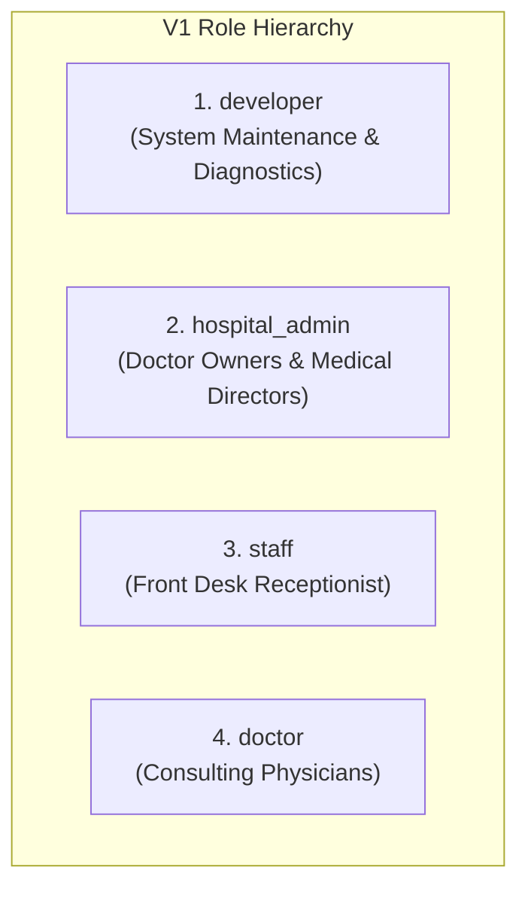

# Roles & Permissions Specification: Spandan Hospital Web

> **Status:** Approved Pre-Implementation Role Specification  
> **Mandate:** Simple, robust Role-Based Access Control (RBAC) enforced at the database level via Supabase Row Level Security (RLS).

---

## 1. Overview of V1 User Roles

For a two-doctor community hospital with front-desk staff, V1 defines exactly four distinct roles:



1. **`developer`**:
   - The technical developer responsible for codebase health, migrations, integrations, and disaster recovery.
   - Has super-admin access across the entire dashboard and database.
2. **`hospital_admin`**:
   - The two operating doctor-owners who run Spandan Hospital.
   - Has full operational authority: can view all patient enquiries, change enquiry statuses, add/edit doctors, publish/archive clinical services, update hospital emergency numbers and announcements, and view activity logs.
3. **`staff`**:
   - The front-desk receptionist or clinic coordinator.
   - Day-to-day front desk operations: views inbound appointments, calls patients, updates enquiry status (`New` -> `Contacted` -> `Confirmed` -> `Cancelled`), enters internal notes, triggers manual notification retries, and exports the daily enquiry roster to CSV.
   - Cannot modify hospital contact phone numbers, global settings, or deactivate doctor profiles.
4. **`doctor`**:
   - Consulting doctors visiting the hospital.
   - Can view appointments specifically assigned to their department/roster, add consultation notes, and view/request updates to their OPD timings.

---

## 2. Permissions Matrix

| Operational Capability | `developer` | `hospital_admin` | `staff` (Reception) | `doctor` | Public (`anon`) |
| :--- | :---: | :---: | :---: | :---: | :---: |
| **Submit Public Appointment** | N/A | N/A | N/A | N/A | Via Server Action only |
| **Direct REST Insert on Enquiries** | Blocked | Blocked | Blocked | Blocked | **BLOCKED** |
| **View All Patient Enquiries** | Yes | Yes | Yes | Assigned only | **BLOCKED** |
| **Update Enquiry Status & Desk Notes** | Yes | Yes | Yes | Own patients | No |
| **Retry Failed Email Alerts** | Yes | Yes | Yes | No | No |
| **Export Enquiries to CSV** | Yes | Yes | Yes | No | No |
| **Manage Doctors (Add/Edit/Archive)** | Yes | Yes | View only | Own hours | View published |
| **Manage Services (Add/Edit/Archive)**| Yes | Yes | View only | View only | View published |
| **Approve / Feature Testimonials** | Yes | Yes | View only | View only | View published |
| **Update Hospital Settings (Phones, Banner)** | Yes | Yes | No | No | View settings |
| **View Admin Activity Logs** | Yes | Yes | No | No | No |
| **System Diagnostics (`/api/health`)**| Yes | Yes | No | No | Public (summary) |

---

## 3. Implementation Mechanism in Supabase

### A. Role Assignment
Roles are assigned upon user invitation or creation in Supabase Auth and stored in the user's `raw_app_meta_data`:
```json
{
  "role": "hospital_admin"
}
```
Because `raw_app_meta_data` can only be altered using the Supabase Service Role Key (and never by the client user), it cannot be spoofed by a client session.

### B. Database-Level Enforcement Helper
A secure PostgreSQL helper function extracts the authenticated user's role:
```sql
CREATE OR REPLACE FUNCTION auth.user_role() 
RETURNS text 
LANGUAGE sql STABLE 
AS $$
  SELECT COALESCE(
    (current_setting('request.jwt.claims', true)::jsonb -> 'app_metadata' ->> 'role'),
    'anon'
  );
$$;
```

### C. Example RLS Policy with Role Checks
```sql
-- Only hospital_admin and developer can update hospital_settings
CREATE POLICY "Admins update settings" 
ON hospital_settings FOR UPDATE 
TO authenticated 
USING (auth.user_role() IN ('developer', 'hospital_admin'));

-- Reception staff, doctors, and admins can view enquiries
CREATE POLICY "Staff view enquiries" 
ON enquiries FOR SELECT 
TO authenticated 
USING (
  auth.user_role() IN ('developer', 'hospital_admin', 'staff')
  OR (auth.user_role() = 'doctor' AND doctor_id = auth.uid())
);
```

---

## 4. UI Dashboard Guarding

In the Next.js admin dashboard:
1. Navigational links are conditionally rendered based on the active session role:
   - Receptionists (`staff`) see: **Dashboard**, **Enquiries**, **Doctor Schedules**
   - Doctors (`doctor`) see: **Dashboard**, **My Appointments**, **My Schedule**
   - Administrators (`hospital_admin`, `developer`) see the full suite: **Dashboard**, **Enquiries**, **Doctors**, **Services**, **Testimonials**, **Settings**, **Activity Log**
2. Any unauthorized direct URL navigation (e.g., a receptionist accessing `/admin/settings`) is intercepted by Next.js Server-side checks and redirected with a permission warning.
