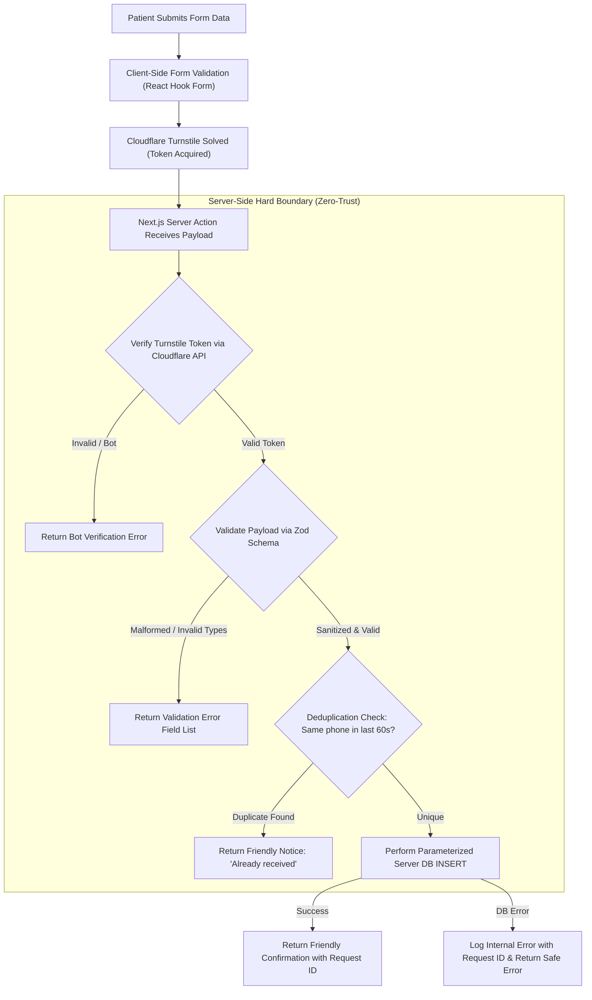

# Security Architecture & Policies: Spandan Hospital Web

> **Status:** Approved Security Specification (Future-Proof Security Invariants)  
> **Core Mandate:** Database-level RLS, zero public REST insert on enquiries, strict clinical data minimization, and absolute secret isolation across V1 and all future versions.

---

## 1. Core Security Principles

1. **Zero Secret Leakage:**  
   API secret keys, service role keys, and database credentials must never be bundled into client-side code or committed to Git.
2. **Server-Side Public Ingestion Hard Boundary:**  
   Public appointment forms do **not** have direct anonymous `INSERT` access to the Supabase REST API. Every submission passes through a Next.js Server Action running on the application server.
3. **Database-Level Authorization (Row Level Security):**  
   Security is enforced inside PostgreSQL via Row Level Security (RLS). Frontend route guards are for navigation convenience only; the database rejects unauthorized queries directly.
4. **Healthcare Data Minimization:**  
   The public form collects strictly operational contact information (Name, Phone, Optional Email, Requested Doctor/Service, Date/Time, and a brief `visit_reason`). The system strictly avoids collecting clinical records, prescriptions, or medical histories.
5. **Least Privilege & Role Boundaries:**  
   User roles (`developer`, `hospital_admin`, `staff`, `doctor`) have explicit database permissions. Public visitors cannot read any patient submissions or unpublished content.
6. **Security Invariant Across Future Integrations:**  
   Future extensions (WhatsApp API, payments, AI assistance, HIS syncing) must **never** weaken this baseline security. Optional integrations must run purely on the server, respect role permissions, and never expose service-role credentials to the browser. **Never solve an implementation bug by disabling RLS or Turnstile.**

---

## 2. Secrets Management & Environment Hygiene

### Allowed Client Variables (`NEXT_PUBLIC_*`)
Only variables safe for public browsers:
- `NEXT_PUBLIC_SUPABASE_URL` (Supabase project API gateway)
- `NEXT_PUBLIC_SUPABASE_ANON_KEY` (Restricted anonymous key governed by RLS)
- `NEXT_PUBLIC_TURNSTILE_SITE_KEY` (Public Cloudflare Turnstile widget key)
- `NEXT_PUBLIC_APP_URL` (Production URL, e.g., `https://spandanhospital.in`)

### Strictly Protected Server Secrets (Server-Only)
These variables must never leak to the client:
- `SUPABASE_SERVICE_ROLE_KEY` (Bypasses RLS — used exclusively in secure Server Actions/Route Handlers)
- `RESEND_API_KEY` (Transactional email dispatch)
- `TURNSTILE_SECRET_KEY` (Server-to-server challenge verification with Cloudflare)

### Repository Hygiene
- `.gitignore` must enforce exclusion of:
  ```text
  .env
  .env.local
  .env.production
  *.pem
  *.key
  ```
- `.env.example` must be kept updated with descriptive placeholders.
- **Never commit patient data, export CSV files, or database dumps to Git.**

---

## 3. Threat Modeling & Countermeasures

| Threat Vector | Severity | Architectural Countermeasure |
| :--- | :--- | :--- |
| **Bypassing Turnstile via Direct API Call** | Critical | **No direct public REST insert.** Anon role has no `INSERT` policy on `enquiries`. All submissions must run through Next.js Server Action where Turnstile is verified. |
| **Automated Bot Form Flooding** | High | Cloudflare Turnstile token validated server-to-server on every submission attempt before database insertion. |
| **Rapid Duplicate Submissions** | Medium | Server Action checks for identical `patient_phone` submitted within the last 60 seconds; returns friendly notice without creating duplicate records. |
| **Sensitive Clinical Data Disclosure** | High | Form field labeled `visit_reason` with prominent disclaimer: *"Do not enter medical histories or diagnostic reports. Our doctor will review your records in person."* |
| **Patient Contact Data Exposure** | Critical | Strict RLS: `enquiries` table has **zero public SELECT policy**. Only authenticated hospital staff can read records. Testimonials display only patient initials or first names. |
| **Dashboard Credential Compromise** | High | Supabase Auth with secure HTTP-only session cookies and strong password requirements. |
| **SQL Injection** | Critical | Parameterized queries handled natively by Supabase PostgREST client and PostgreSQL prepared statements. |
| **Information Leakage via Errors** | Low | Server Actions catch internal exceptions and return friendly, generic error messages to patients with a correlation `requestId`. |

---

## 4. Public Form Ingestion Security Pipeline



---

## 5. Row Level Security (RLS) Specification

```sql
-- 1. ENQUIRIES TABLE
ALTER TABLE enquiries ENABLE ROW LEVEL SECURITY;

-- Anonymous public role has NO direct INSERT or SELECT permissions over REST API.

-- Authenticated staff can view and update enquiries
CREATE POLICY "Staff view enquiries" 
ON enquiries FOR SELECT 
TO authenticated 
USING (true);

CREATE POLICY "Staff update enquiries" 
ON enquiries FOR UPDATE 
TO authenticated 
USING (true);

-- 2. PUBLIC CONTENT TABLES (Doctors, Services, Testimonials)
ALTER TABLE doctors ENABLE ROW LEVEL SECURITY;
ALTER TABLE services ENABLE ROW LEVEL SECURITY;
ALTER TABLE testimonials ENABLE ROW LEVEL SECURITY;

-- Public can read only published items
CREATE POLICY "Public read published doctors" 
ON doctors FOR SELECT 
TO anon 
USING (status = 'published');

CREATE POLICY "Public read published services" 
ON services FOR SELECT 
TO anon 
USING (status = 'published');

CREATE POLICY "Public read published testimonials" 
ON testimonials FOR SELECT 
TO anon 
USING (status = 'published');

-- Staff have full management access
CREATE POLICY "Staff full access doctors" 
ON doctors FOR ALL 
TO authenticated 
USING (true);

CREATE POLICY "Staff full access services" 
ON services FOR ALL 
TO authenticated 
USING (true);

CREATE POLICY "Staff full access testimonials" 
ON testimonials FOR ALL 
TO authenticated 
USING (true);

-- 3. HOSPITAL SETTINGS TABLE
ALTER TABLE hospital_settings ENABLE ROW LEVEL SECURITY;

CREATE POLICY "Public read hospital settings" 
ON hospital_settings FOR SELECT 
TO anon 
USING (true);

CREATE POLICY "Staff update hospital settings" 
ON hospital_settings FOR UPDATE 
TO authenticated 
USING (true);

-- 4. ACTIVITY LOGS TABLE
ALTER TABLE activity_logs ENABLE ROW LEVEL SECURITY;

CREATE POLICY "Staff view activity logs" 
ON activity_logs FOR SELECT 
TO authenticated 
USING (true);

CREATE POLICY "Staff insert activity logs" 
ON activity_logs FOR INSERT 
TO authenticated 
WITH CHECK (true);
```

---

## 6. Role-Based Access Control (RBAC) Matrix

| User Role | View Enquiries | Update Enquiry Status | Export CSV | Edit Doctors/Services | Edit Settings | View Activity Logs |
| :--- | :---: | :---: | :---: | :---: | :---: | :---: |
| `developer` | Yes | Yes | Yes | Yes | Yes | Yes |
| `hospital_admin` | Yes | Yes | Yes | Yes | Yes | Yes |
| `staff` (Reception) | Yes | Yes | Yes | View only | No | No |
| `doctor` | Assigned only | Update notes | No | Own hours only | No | No |

---

## 7. Simple Activity Logging & Incident Response

- Every modification made by an authenticated admin is recorded in `activity_logs`:
  `user_id`, `action`, `entity_type`, `entity_id`, `created_at`.
- If an admin credential is compromised:
  1. Revoke the session immediately in the Supabase Auth dashboard.
  2. Force a password reset.
  3. Inspect `activity_logs` for any unauthorized roster, phone, or setting modifications.
