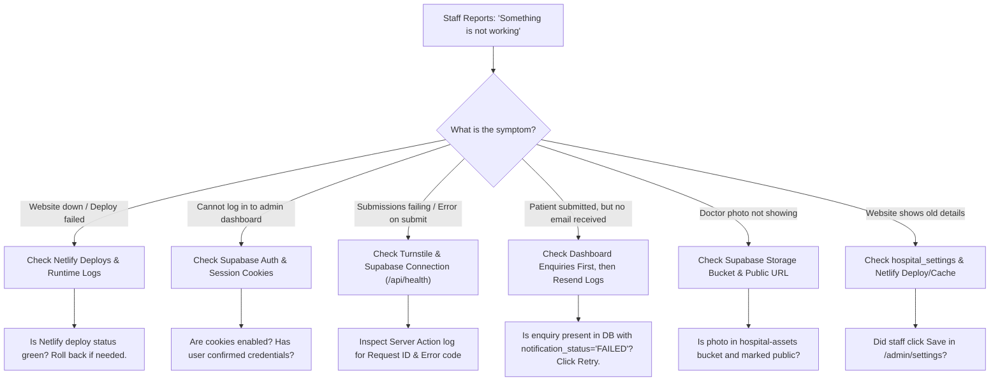

# Developer Troubleshooting Guide: Spandan Hospital Web

> **Purpose:** Practical diagnostic playbook for a solo beginner developer.  
> Whenever hospital staff reports an issue, follow this guide step-by-step to isolate the root cause quickly.

---

## 1. Quick Diagnostic Decision Tree



---

## 2. Isolating Errors by Architectural Layer

Because the codebase is separated into distinct layers, you can isolate bugs in minutes:

| Symptom | Layer at Fault | Where to Look | How to Fix |
| :--- | :--- | :--- | :--- |
| **Form button disabled / doesn't submit** | UI Component | `components/forms/` or `features/appointments/components/` | Check browser console (`F12`); verify client validation state. |
| **"Please enter a valid 10-digit number"** | Validation Layer | `features/appointments/appointments.schema.ts` | Verify Zod phone regex rule (`/^[6-9]\d{9}$/`). |
| **"Verification failed. Please refresh"** | Bot Shield | `lib/turnstile/` & Netlify env variables | Verify `TURNSTILE_SECRET_KEY` matches Cloudflare dashboard. |
| **"Request already received"** | Business Logic | `features/appointments/appointments.service.ts` | Expected deduplication behavior: identical phone submitted within 60s. |
| **"Unable to record request"** | Data Access / DB | `features/appointments/appointments.data.ts` | Check `/api/health`; verify Supabase is not paused. |
| **Email alert not received** | Notification Service | `features/notifications/providers/resend.provider.ts` | Check dashboard status badge; click "Retry Notification". |

---

## 3. Solo-Developer Navigation Map ("Where is X?")

| Question | File / Directory Location |
| :--- | :--- |
| **Where is the appointment booking logic?** | `features/appointments/appointments.service.ts` |
| **Where is public form validation?** | `features/appointments/appointments.schema.ts` |
| **Where are the database queries?** | `features/<feature-name>/<feature-name>.data.ts` |
| **Where is staff authentication?** | `features/authentication/` & `lib/supabase/` |
| **Where are notification dispatchers?** | `features/notifications/providers/resend.provider.ts` |
| **Where are external service credentials?** | Netlify Site Settings & `.env.local` |
| **Where are feature flags?** | Future option only; not built in V1 (see `docs/FUTURE-SCALABILITY.md`) |
| **Where are database migrations?** | `database/migrations/` |
| **Where are branding colors & fonts?** | `app/globals.css` & `tailwind.config.ts` |
| **How do I test a build locally?** | Run `npm run build` in terminal |
| **How do I deploy?** | Push to `main` branch on GitHub; Netlify builds automatically |
| **How do I roll back a broken deploy?** | In Netlify Dashboard > **Deploys**, click previous deploy > **Publish deploy** |
| **How do I troubleshoot production issues?** | Check this guide & visit `https://spandanhospital.in/api/health` |

---

## 4. Category-by-Category Diagnostic Checklists

### A. Hosting & Netlify Deployment Issues
**Symptoms:** Build failure during `git push`; 500 error on production URL.

1. **Check Netlify Deploy Logs:**
   - Log into [netlify.com](https://app.netlify.com).
   - Go to your site > **Deploys** > Click the failed deploy.
   - Look for red build error messages (TypeScript type mismatch or missing env variable).
2. **Immediate Recovery (Instant Rollback):**
   - Click on the previous successful deploy and select **"Publish deploy"**. The live site reverts immediately.
3. **Local Build Test:**
   - Run locally before pushing:
     ```bash
     npm run build
     ```
   - If this succeeds locally without error, check that all environment variables from `.env.example` are present in Netlify site settings.

---

### B. Supabase Inactivity Pause (Free Tier)
**Symptoms:** Public pages load fast, but submitting the appointment form displays *"Our system is temporarily busy"*.

1. **Check Health Check Route:**
   - Open `https://spandanhospital.in/api/health` in your browser.
   - If output shows `"database": "disconnected"`:
2. **Unpause the Database:**
   - Log into [supabase.com/dashboard](https://supabase.com/dashboard).
   - Find `spandan-hospital-prod`.
   - If status is **Paused**, click **"Restore Project"**. Restoring takes 1 to 2 minutes.
   - Once restored, submissions will immediately start working again without redeploying code.

---

### C. Public Appointment Form & Bot Verification Errors
**Symptoms:** Form shows *"Verification failed. Please refresh."*

1. **Cloudflare Turnstile Key Mismatch:**
   - Verify `NEXT_PUBLIC_TURNSTILE_SITE_KEY` matches the public key in your Cloudflare dashboard.
   - Verify `TURNSTILE_SECRET_KEY` matches the secret key in Netlify environment variables.
   - Ensure the Turnstile widget domain settings in Cloudflare include your production domain (e.g., `spandanhospital.in`) as well as `localhost`.
2. **Trace Using Request ID:**
   - Every submission generates a unique `requestId` (e.g., `SPD-202610-0042`).
   - Search for this ID in Netlify Functions runtime logs to inspect the exact failure reason.

---

### D. Notification & Email Failures (Resend)
**Symptoms:** Patient submitted an appointment, but the hospital reception inbox has not received an email alert.

1. **Step 1: Check Database First (Source of Truth):**
   - Log into `/admin/enquiries`.
   - Search for the patient's name or mobile number.
   - If the enquiry is in the list: **No patient data was lost!** Staff can immediately call or WhatsApp the patient.
2. **Step 2: Inspect Notification Status Badge:**
   - If badge displays `FAILED`:
     - Hover to view error detail (e.g., `Timeout after 3s`, `Domain unverified`, or `Daily quota exceeded`).
   - Click the **"Retry Notification"** button next to the enquiry to trigger an immediate resend.
3. **Step 3: Check Resend Dashboard:**
   - Log into [resend.com/emails](https://resend.com/emails).
   - Check if the email was delivered, bounced, or placed in spam.
   - Verify that hospital domain DNS records (SPF, DKIM, DMARC) are in "Verified" status.

---

### E. Media & Storage Issues
**Symptoms:** Doctor photo shows a broken image icon.

1. **Verify Bucket Visibility:**
   - Open **Supabase Dashboard > Storage > Buckets**.
   - Ensure the `hospital-assets` bucket is set to **Public**.
2. **Check Image URL:**
   - Open image URL in an incognito window:
     `https://<project-id>.supabase.co/storage/v1/object/public/hospital-assets/doctors/doctor-1.jpg`
   - If 403 Forbidden: Storage policy needs `SELECT` enabled for `public`.
3. **File Size Limit:**
   - Maximum upload size is 5 MB. Optimize large camera files before uploading.

---

### F. Diagnostic Health Check Endpoint

A lightweight health check endpoint at `/api/health` allows immediate diagnosis of operational components:

- **Endpoint:** `GET /api/health`
- **Healthy Response (200 OK):**
  ```json
  {
    "status": "healthy",
    "timestamp": "2026-10-06T18:45:00Z",
    "database": "connected",
    "environment": "production"
  }
  ```
- **Unhealthy Response (503 Service Unavailable):**
  ```json
  {
    "status": "degraded",
    "timestamp": "2026-10-06T18:45:00Z",
    "database": "disconnected",
    "error": "Database connection timeout. Check Supabase project status."
  }
  ```
