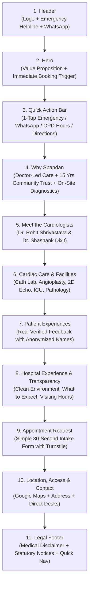

# Spandan Hospital: Master Homepage UX Blueprint

> **Document Type:** Experience Architecture & Patient Flow Blueprint  
> **Target Entity:** Spandan Hospital (Lalghati / Airport Road, Bhopal, MP)  
> **Design Philosophy:** Doctor-led community cardiac center — Calm, dignified, accessible, ultra-reliable.  
> **Key Guardrail:** Avoid corporate aggregator bloat (no sprawling multi-specialty mega-menus, no chatbot gimmicks, no fake health packages). Emphasize immediate accessibility to the two senior cardiologists and front desk.

---

## High-Level Patient Journey Flow

---

## Detailed Section-by-Section UX Blueprint

### 1. Header & Utility Navigation
* **Objective:** Establish instant credibility, provide immediate emergency access, and allow seamless navigation without visual clutter.
* **Patient Question Being Answered:** *"Is this the official Spandan Hospital website in Lalghati, and how do I contact them right now?"*
* **Required Content:**
  - Hospital official logo & name.
  - Emergency hotline badge (high-contrast red/amber).
  - Main navigation anchors: "Doctors", "Cardiac Care", "Services", "About Us", "Contact".
  - Primary header action: "Book Consultation" button.
* **Recommended CTA:**
  - Desktop: "Book Appointment" (primary solid button) + "Emergency: 0755-4931846" (call link).
  - Mobile: Prominent phone icon button + clean hamburger drawer.
* **Trust Element:** Verified hospital identity with clear Bhopal location indicator ("Lalghati, Bhopal").
* **Mobile Behavior:** Sticky minimal header with logo, direct click-to-call icon, and hamburger menu. Zero horizontal overflow; touch targets minimum 48px.
* **Data Requiring Hospital Verification:** Official logo file, active emergency phone number.

---

### 2. Homepage Hero
* **Objective:** Immediately reassure anxious patients and family members that they have found a reputable, specialized cardiac center with senior doctor leadership in western Bhopal.
* **Patient Question Being Answered:** *"What does Spandan Hospital specialize in, who leads it, and how quickly can I see a cardiologist?"*
* **Required Content:**
  - Primary headline: Warm, confident, reassuring (e.g., *"Specialized Cardiac Care & Experienced Cardiologists in Lalghati, Bhopal"*).
  - Supportive subheadline highlighting non-invasive and interventional heart care with personalized doctor attention.
  - Value badges: *"Led by Senior DM Cardiologists"*, *"Advanced ICU & Cath Lab Support"*, *"Over 15 Years Serving Bhopal"*.
  - Dual action buttons: Primary appointment request and secondary direct WhatsApp consultation.
* **Recommended CTA:**
  - Primary: "Request OPD Consultation" (smooth scrolls to section 9).
  - Secondary: "Consult on WhatsApp" (opens `wa.me` with pre-filled message).
* **Trust Element:** Clear mention of the two senior cardiologists and their DM Cardiology credentials right in the hero subtitle.
* **Mobile Behavior:** Stacked single-column layout; text leads first followed by thumb-friendly full-width buttons. Hero image sits below or subtly in background with opacity overlay for readability.
* **Data Requiring Hospital Verification:** Exact hero headline/tagline approval, official facade or lobby photography.

---

### 3. Quick Action Bar
* **Objective:** Give high-intent mobile visitors immediate 1-tap utility without having to scroll or read extensive paragraphs.
* **Patient Question Being Answered:** *"I need an ambulance / I need directions / I want to check OPD timings right now."*
* **Required Content:**
  - 4 high-priority utility cards:
    1. **Emergency / Chest Pain:** Direct phone dialer.
    2. **WhatsApp Chat:** Instant desk connection.
    3. **OPD Timings:** Active consultation window indicator (e.g., "Today: 12 PM – 6 PM").
    4. **Hospital Directions:** 1-tap Google Maps route planner.
* **Recommended CTA:** Direct actions on each card (Tap to Call, Tap to Chat, View Schedule, Open Maps).
* **Trust Element:** Live status badge ("OPD Open Today" or "Desk Active").
* **Mobile Behavior:** 2x2 grid or horizontal scrollable cards with oversized touch targets. Floats right below hero for instant accessibility.
* **Data Requiring Hospital Verification:** Emergency contact number, WhatsApp number, exact daily OPD consultation hours.

---

### 4. Why Spandan (The Doctor-Led Difference)
* **Objective:** Differentiate Spandan from both faceless corporate hospital chains and small non-specialized nursing homes.
* **Patient Question Being Answered:** *"Why should I choose Spandan Hospital instead of a large commercial hospital chain in Bhopal?"*
* **Required Content:**
  - 4 foundational pillars:
    1. **Direct Senior Doctor Attention:** Consult directly with DM Cardiologists who personally evaluate and manage your treatment, not rotating junior interns.
    2. **Focused Cardiac Infrastructure:** Integrated on-site diagnostics, 10-bed Intensive Cardiac Care Unit (ICCU), and Cath Lab support for prompt intervention.
    3. **Compassionate, Calm Environment:** 35-bed setup designed to reduce patient anxiety, eliminate bureaucratic delays, and provide attentive nursing.
    4. **Hyperlocal Accessibility:** Conveniently situated on Airport Road, Lalghati, saving crucial transit time for families in western and northern Bhopal.
* **Recommended CTA:** "Learn About Our Doctors & Facilities".
* **Trust Element:** Factual, non-exaggerated claims backed by doctor credentials and physical facility capacity.
* **Mobile Behavior:** Clean single-column stacked cards with subtle icons and calm borders.
* **Data Requiring Hospital Verification:** Bed counts (35 total, 10 ICU) and 15-year operational history badge.

---

### 5. Meet the Cardiologists
* **Objective:** Position the two doctors at the emotional and clinical core of the hospital identity. Build deep patient confidence before they even visit.
* **Patient Question Being Answered:** *"Who will actually treat me or my family member, and what are their qualifications?"*
* **Required Content:**
  - Individual doctor presentation cards for:
    - **Dr. Rohit Kumar Shrivastava** — Consultant Interventional Cardiologist (MBBS, MD, DM Cardiology).
    - **Dr. Shashank Dixit** — Consultant Interventional Cardiologist (MBBS, MD, DM Cardiology, FACC).
  - High-resolution, warm professional portrait for each doctor.
  - Specialization badges: Interventional Cardiology, Angioplasty, Pacemaker, Heart Failure, Preventive Cardiology.
  - OPD Consultation Timings clearly displayed under each doctor.
  - Dedicated "Book with Dr. [Name]" button on each profile.
* **Recommended CTA:** "Book Consultation with Dr. Rohit" / "Book Consultation with Dr. Shashank" (pre-selects doctor in appointment form).
* **Trust Element:** Verified degrees (DM Cardiology from recognized national institutes, FACC fellowship).
* **Mobile Behavior:** Vertical carousel or two cleanly stacked profile cards with clear, non-cramped typography.
* **Data Requiring Hospital Verification:** High-res studio portraits, verified bios, and confirmed consultation hours for both doctors.

---

### 6. Cardiac Care & Clinical Services
* **Objective:** Provide a transparent, structured directory of clinical procedures, diagnostics, and facilities available on-site.
* **Patient Question Being Answered:** *"Does this hospital perform angioplasty? Can I get a 2D Echo or ECG done here without going elsewhere?"*
* **Required Content:**
  - 6 clearly categorized service blocks:
    1. **Interventional Cardiology:** Coronary Angiography, Angioplasty & Stenting (PTCA), Balloon Valvuloplasty.
    2. **Cardiac Rhythm Management:** Permanent & Temporary Pacemaker Implantation, Arrhythmia Care.
    3. **Non-Invasive Diagnostics:** 2D Echocardiography, Color Doppler, TMT (Treadmill Test), ECG, Holter Monitoring.
    4. **Intensive Cardiac Care (ICCU):** 24/7 multipara-monitored beds with ventilator support for acute coronary emergencies.
    5. **Pathology & Imaging:** In-house pathology lab for rapid cardiac markers (Troponin-I, CPK-MB) and digital X-ray.
    6. **On-Site Pharmacy:** Dedicated dispensary for cardiac medications.
* **Recommended CTA:** "Inquire About This Service" (links to contact/appointment).
* **Trust Element:** Clear descriptions of non-invasive vs interventional procedures with zero clinical jargon overload.
* **Mobile Behavior:** Accordion or compact cards with expandable "What to Expect" bullets.
* **Data Requiring Hospital Verification:** Final confirmation of all listed procedures and diagnostics from doctors.

---

### 7. Patient Stories & Real Experiences
* **Objective:** Provide credible social proof from real patients who experienced successful treatment at the hospital.
* **Patient Question Being Answered:** *"How did other heart patients feel here? Was the doctor caring and the treatment successful?"*
* **Required Content:**
  - 3–4 authentic, hospital-approved testimonials.
  - Anonymized patient identifiers: initials or first name with location (e.g., *"R. K. Sharma, Bairagarh"*, *"Mrs. Anjali S., Lalghati"*).
  - Specific context tag: *"Emergency Angioplasty"*, *"Hypertension & OPD Checkup"*, *"ICU Recovery"*.
  - Factual rating indicator (e.g. 5-star rating) accompanied by directory source attribution ("Reviewed on Justdial / Direct Patient Feedback").
* **Recommended CTA:** "Read Patient Guidelines".
* **Trust Element:** Respect for patient privacy; genuine, conversational language without staged marketing hype.
* **Mobile Behavior:** Horizontal swipeable testimonial carousel with pagination dots.
* **Data Requiring Hospital Verification:** Hospital management sign-off on exact patient feedback text and consent.

---

### 8. Hospital Experience & Patient Transparency
* **Objective:** Alleviate anxiety about hospital visits by explaining practical logistics: what to bring, visiting hours, and what happens upon arrival.
* **Patient Question Being Answered:** *"What should I expect when I walk into the hospital? What are the visitor rules?"*
* **Required Content:**
  - Step-by-step patient journey outline:
    1. **Arrival & Desk Check-In:** Present token or appointment SMS at reception.
    2. **Pre-Consultation Vitals:** Quick BP, pulse, and preliminary ECG check by nursing staff.
    3. **Doctor Consultation:** In-depth review of symptoms, past reports, and dietary lifestyle.
    4. **On-Site Diagnostics:** Swift completion of Echo/blood tests without leaving the premises.
  - Practical hospital logistics: General Ward Visiting Hours, ICU Visiting Hours, Wheelchair / Ramp Accessibility, Parking guidance.
* **Recommended CTA:** "View Location & Directions".
* **Trust Element:** Transparent operational guidelines demonstrating thoughtful patient-centered organization.
* **Mobile Behavior:** Clean vertical timeline or icon list with bite-sized bullet points.
* **Data Requiring Hospital Verification:** Exact visiting hours and facility accessibility features.

---

### 9. Appointment Request Section
* **Objective:** Convert interested visitors into confirmed appointments with minimum friction, zero spam, and absolute healthcare data privacy.
* **Patient Question Being Answered:** *"How do I schedule an appointment without waiting on hold or creating a complicated user account?"*
* **Required Content:**
  - Clean, high-trust appointment form containing strictly non-sensitive fields:
    - Patient Full Name
    - Mobile Phone Number (10 digits)
    - Optional Email
    - Preferred Doctor (Dr. Rohit / Dr. Shashank / Any Available)
    - Preferred Service (Consultation, 2D Echo, Health Checkup, General Enquiry)
    - Preferred Date & Preferred Time Slot (Morning / Afternoon / Evening)
    - Short Reason for Visit (Single line: e.g. "Routine Heart Checkup", "Blood Pressure", "Follow-up")
  - Explicit healthcare guardrail notice: *"Please do NOT enter sensitive medical histories, lab results, or prescriptions here. For medical emergencies, call our desk immediately."*
  - Cloudflare Turnstile anti-bot widget.
  - Clear SLA expectation badge: *"Our reception desk will call you within 30 minutes to confirm your time slot."*
* **Recommended CTA:** "Submit Appointment Request" (prominent primary button with loading state).
* **Trust Element:** Instant submission confirmation modal with unique Request ID and direct reception hotline for immediate verification.
* **Mobile Behavior:** Single-column layout with large numeric keypad triggers for phone input and native date pickers.
* **Data Requiring Hospital Verification:** Reception desk callback turnaround commitment, front desk alert email.

---

### 10. Contact, Directions & Accessibility
* **Objective:** Ensure patients and their drivers can find the hospital effortlessly from any corner of Bhopal.
* **Patient Question Being Answered:** *"Where exactly is the hospital located, how do I get there by car/auto, and who do I call if I get lost?"*
* **Required Content:**
  - Verified physical address with landmark (e.g., *"B-122 Indra Vihar Colony, Airport Road, near Lalghati Square, Bhopal - 462030"*).
  - Responsive embedded Google Maps iframe.
  - Direct 1-tap "Get Directions in Google Maps" button.
  - Reception Desk Phone, 24/7 Emergency Line, WhatsApp Quick Link.
  - Operating & OPD Timings summary table.
* **Recommended CTA:** "Get Driving Directions" + "Call Reception Desk".
* **Trust Element:** Real landmark guidance ("5 minutes from Lalghati Square on Airport Road").
* **Mobile Behavior:** Map placed with lazy loading to preserve mobile speed, followed by full-width tap-to-call buttons.
* **Data Requiring Hospital Verification:** Exact plot numbers, confirmed PIN code, Google Maps GPS coordinates.

---

### 11. Footer & Statutory Compliance
* **Objective:** Provide legal disclaimers, medical ethics compliance, emergency reiteration, and quick links.
* **Patient Question Being Answered:** *"Is this an official healthcare establishment, and what are their privacy terms?"*
* **Required Content:**
  - Hospital legal name & copyright notice.
  - Prominent Medical Disclaimer: *"The content on this website is for informational and operational purposes only and does not constitute medical advice, diagnosis, or treatment. In case of a medical emergency, immediately visit the nearest emergency facility or call our desk."*
  - Data Privacy statement: *"We collect minimal operational data solely to coordinate your visit. We never share or sell patient contact information."*
  - Quick navigation links (Doctors, Services, Appointments, Contact).
  - Discreet "Hospital Staff Login" link leading to `/admin/login`.
* **Recommended CTA:** Quick navigation links & staff portal access.
* **Trust Element:** Professional statutory transparency and clean copyright branding.
* **Mobile Behavior:** Compact multi-column stack collapsing into clean accordions or readable lists.
* **Data Requiring Hospital Verification:** Legal hospital registration name.
