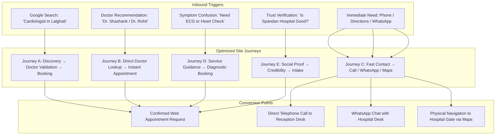

# Spandan Hospital: Patient Journey Architecture

> **Document Type:** Patient Experience & Conversion Flow Analysis  
> **Target Entity:** Spandan Hospital (Lalghati / Airport Road, Bhopal, MP)  
> **Core Principle:** Streamlined, dignified, and friction-free patient pathways. Every journey addresses real anxiety, respects patient time, and minimizes operational delays.

---

## Journey Overview Matrix

---

## Journey A: Patient Discovers Hospital → Learns About Doctors → Books Appointment

* **Patient Persona:** Suresh (54), experiencing mild shortness of breath and elevated blood pressure, lives in Bairagarh/Lalghati. Googles *"heart specialist near Lalghati Bhopal"* on his smartphone.
* **Emotional State:** Anxious, cautious, seeking high competence close to home without the chaos of a mega-hospital.
* **Entry Point:** Homepage Hero via organic search or local link.
* **Step-by-Step Flow:**
  1. **Land on Hero:** Suresh reads clear headline confirming Spandan Hospital is a specialized cardiac care center on Airport Road, Lalghati, led by senior DM Cardiologists.
  2. **Scroll to 'Why Spandan':** Notes that the hospital has 15+ years of community trust, on-site diagnostics, and dedicated doctor attention.
  3. **Explore 'Meet the Cardiologists':** Reviews profiles of Dr. Rohit Kumar Shrivastava and Dr. Shashank Dixit. Sees their DM Cardiology qualifications and OPD consultation hours (12:00 PM – 6:00 PM).
  4. **Click CTA on Doctor Card:** Clicks *"Book Consultation with Dr. Shashank Dixit"*.
  5. **Auto-Populated Form:** Page smoothly scrolls down to the Appointment Request form; *"Dr. Shashank Dixit"* is pre-selected in the doctor dropdown.
  6. **Quick Input (30 Seconds):** Suresh fills in his name, mobile number, selects tomorrow afternoon, types short reason: *"BP checkup & breathlessness"*, passes Turnstile verification.
  7. **Submission Confirmation:** Receives instant confirmation modal with Request ID `#SP-XXXX` and friendly message: *"Thank you Suresh. Our front desk will call you within 30 minutes to confirm your appointment time."*
* **Friction Reducer:** Pre-selecting the doctor saves cognitive load; clear expectation of a 30-minute callback prevents anxious re-submitting.
* **Failure Recovery:** If front desk is closed (after 7 PM), confirmation modal states: *"Submitted after desk hours. Our team will call you tomorrow morning at 10:00 AM."*

---

## Journey B: Patient Already Knows Doctor → Directly Requests Appointment

* **Patient Persona:** Vandana (42), daughter of a previous cardiac patient. A family friend specifically told her: *"Consult Dr. Rohit Shrivastava at Spandan Hospital on Airport Road"*.
* **Emotional State:** Focused, high-intent, in a hurry to secure a slot with Dr. Rohit.
* **Entry Point:** Homepage, searches for Dr. Rohit immediately.
* **Step-by-Step Flow:**
  1. **Land on Header / Navbar:** Taps "Doctors" in the top navigation bar.
  2. **Instant Anchor Scroll:** Screen jumps directly to the "Meet the Cardiologists" section.
  3. **Doctor Verification:** Sees Dr. Rohit Kumar Shrivastava's portrait, qualifications (MBBS, MD, DM Cardiology), and consultation timings.
  4. **Direct Booking CTA:** Taps *"Book with Dr. Rohit"*.
  5. **Complete Form:** Fills in patient details (mother's name and contact number), selects preferred date, submits.
  6. **Outcome:** Request captured in Supabase database, alert dispatched to hospital desk.
* **Friction Reducer:** No multi-level menu navigation or required account registration. No forced OTP delays.
* **Failure Recovery:** If the doctor is on leave or unavailable, the front desk can contact the patient directly via phone to reschedule or offer Dr. Shashank Dixit as an alternate.

---

## Journey C: Patient Wants Immediate Contact → Phone / WhatsApp / Directions

* **Patient Persona:** Manoj (38), driving his father who has uncomfortable chest heaviness. Needs to know if the hospital is open right now, where the gate is, or wants to call ahead.
* **Emotional State:** High urgency, stressed, driving or sitting in a car, needs instant 1-tap buttons with zero text hurdles.
* **Entry Point:** Homepage via mobile phone.
* **Step-by-Step Flow:**
  1. **Land on Mobile Hero:** The sticky header and Quick Action Bar immediately show two large, high-contrast actions:
     - **Red/Emergency Button:** *"Call Emergency Desk: 0755-4931846"*
     - **Green WhatsApp Button:** *"Chat on WhatsApp"*
     - **Directions Button:** *"Directions / Location"*
  2. **Action 1 (Call Ahead):** Taps the phone button. Phone native dialer opens with number pre-filled; taps dial to speak to reception immediately.
  3. **Action 2 (Navigate):** Taps *"Get Directions"*. Google Maps app launches immediately with GPS navigation routed straight to Spandan Hospital on Airport Road.
  4. **Action 3 (Quick WhatsApp):** If Manoj prefers text, tapping WhatsApp launches chat with pre-written text: *"Hello Spandan Hospital, I need information regarding immediate consultation / emergency."*
* **Friction Reducer:** No hidden phone numbers behind "Contact Us" sub-pages. Sticky header keeps emergency call within thumb reach at all scroll depths.
* **Failure Recovery:** Landline desk number has backup mobile number displayed clearly below.

---

## Journey D: Patient Unsure What Service They Need → Guided Service Discovery

* **Patient Persona:** Rajesh (60), recently felt irregular palpitations and dizziness. Unsure whether he needs a general physician, an ECG, a 2D Echo, or an angiography consultation.
* **Emotional State:** Confused by medical jargon, worried about excessive test costs or wrong department visits.
* **Entry Point:** Homepage, scrolls past hero to "Cardiac Care & Services".
* **Step-by-Step Flow:**
  1. **Review Service Cards:** Rajesh browses the clean 6-card services overview:
     - Sees **Non-Invasive Diagnostics** (ECG, 2D Echo, TMT, Holter).
     - Reads the plain-language explanation: *"Non-invasive cardiac checks evaluate your heart's rhythm, valve function, and blood flow comfortably in under 30 minutes."*
  2. **Card Reassurance:** Sees that Spandan has in-house pathology and imaging, meaning all preliminary tests happen in one place.
  3. **Click 'Inquire About Service':** Taps button on the Non-Invasive Diagnostics card.
  4. **Form Pre-Selection:** Appointment form opens with Service pre-set to *"Non-Invasive Diagnostics / Cardiac Check"*.
  5. **Submit Request:** Enters details with note: *"Palpitations and dizziness, need checkup guidance."*
  6. **Desk Triaging:** Receptionist reviews the note and schedules Rajesh during OPD hours with an instruction to come with previous medical prescriptions.
* **Friction Reducer:** Clear, patient-friendly explanations avoid medical intimidation. Pre-selection guides the patient without forcing a self-diagnosis.
* **Failure Recovery:** Reassurance disclaimer clarifies that doctor will clinically determine which tests are actually needed after physical examination.

---

## Journey E: Patient Wants Proof & Trust → Doctors + Testimonials + Hospital Credibility

* **Patient Persona:** Meenakshi (49), advised by a local clinic to undergo a coronary angiography for persistent angina. Wants to thoroughly verify the hospital's reputation before agreeing to any invasive procedure.
* **Emotional State:** Skeptical, protective, evaluating hospital safety, hygiene, doctor credentials, and past patient outcomes.
* **Entry Point:** Homepage via desktop or tablet at home.
* **Step-by-Step Flow:**
  1. **Examine Doctor Qualifications:** Inspects doctor profiles. Verifies that both cardiologists hold super-specialized DM (Doctor of Medicine in Cardiology) degrees from premier medical institutions and FACC fellowships.
  2. **Review Hospital Experience Section:** Reads the "Hospital Experience" guide: discovers clean 35-bed facility, 10-bed monitored ICU, transparent patient visit protocol, and strict hygiene standards.
  3. **Read Patient Stories:** Reads authentic experiences of real patients who underwent angiography and stenting at Spandan Hospital. Notes specific praise for prompt ICU care and direct doctor counseling.
  4. **Inspect Physical Location:** Views the Google Maps embed, confirming established presence on Airport Road, Lalghati.
  5. **Reach Out with Confidence:** Having verified credibility, Meenakshi either submits the appointment form for a second-opinion consultation or clicks the WhatsApp button to ask about angiography admission procedures.
* **Friction Reducer:** Authentic patient quotes with privacy-preserving initials create genuine credibility without looking like paid marketing ads.
* **Failure Recovery:** Direct phone number always visible for patients who want to speak to the hospital manager or nursing superintendent directly.
